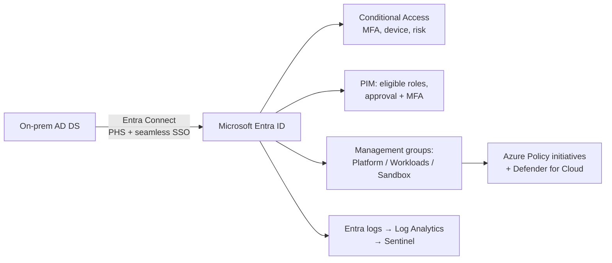
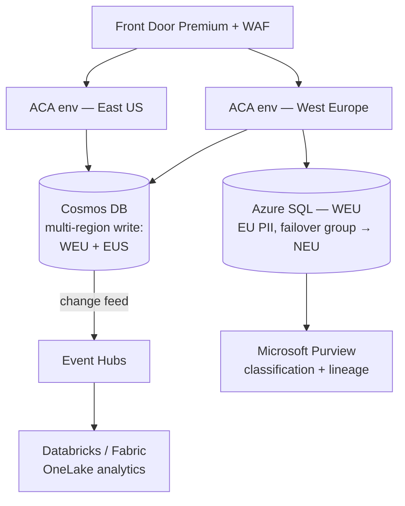
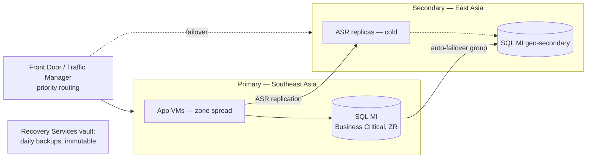
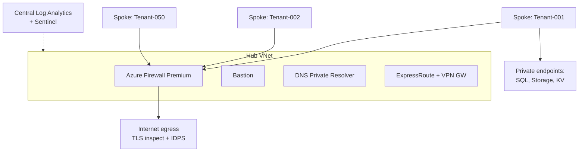
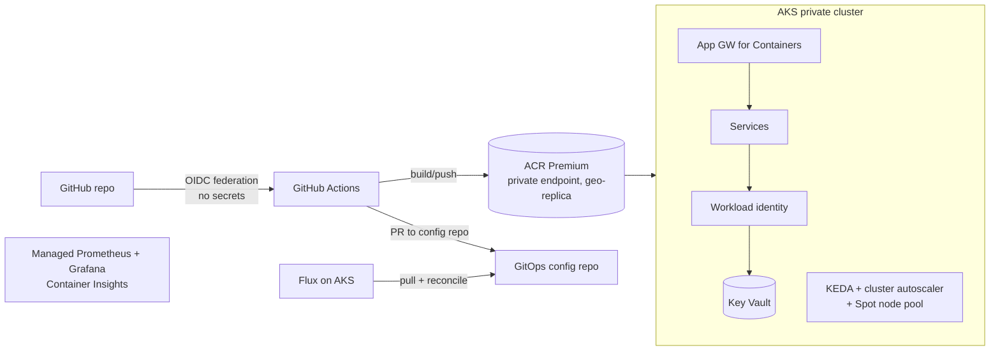

# Azure Architect Mastery — Enterprise APIs & AZ-305 Study Guide

A comprehensive guide covering Azure API Management, Service Bus, RBAC, Cloud Networking, Container Apps, authentication/authorization patterns, and enterprise API architecture — aligned to the AZ-305 (Azure Solutions Architect Expert) exam.

---

## 1. Azure API Management (APIM)

### 1.1 What APIM Is

Azure API Management is a hybrid, multicloud platform for publishing, securing, transforming, and monitoring APIs. It sits between API consumers and backend services as a **facade**, decoupling clients from backend implementation.

**Three core components:**

- **API Gateway (data plane):** Accepts API calls, routes to backends, verifies keys/JWTs/certificates, enforces quotas and rate limits, transforms requests/responses, caches, and emits logs/metrics/traces.
- **Management plane:** Azure portal / ARM / Bicep / Terraform / CLI surface for provisioning, defining APIs, packaging into products, setting policies, and analytics.
- **Developer portal:** Auto-generated, customizable website where consumers discover APIs, read interactive docs, try APIs in a console, and get subscription keys.

### 1.2 Tiers (know these for the exam)

| Tier | Key traits | Use case |
|---|---|---|
| **Consumption** | Serverless, per-call billing, scale-to-zero, no VNet injection, ~sub-second activation | Lightweight/serverless APIs, spiky traffic |
| **Developer** | Full features, no SLA, single unit | Dev/test, evaluation |
| **Basic** | 99.95% SLA, small scale | Entry production |
| **Standard** | 99.95% SLA, more scale units | Medium production |
| **Premium** | Multi-region deployment, VNet injection, availability zones, self-hosted gateway, workspaces, higher scale | Enterprise, hybrid, mission-critical |
| **v2 tiers (Basic v2, Standard v2, Premium v2)** | Faster provisioning/scaling, VNet **integration** (outbound) in Standard v2; Premium v2 adds VNet injection | Modern deployments needing agility |

**Exam signal:** "multi-region," "VNet injection," "availability zones," or "self-hosted gateway" → **Premium** (or Premium v2 for injection).

### 1.3 Core Concepts

- **APIs and operations:** An API maps to a backend; operations map to endpoints. Import from OpenAPI, WSDL, gRPC (self-hosted), Azure Functions, Logic Apps, Container Apps, AKS.
- **Products:** Bundles of one or more APIs with a title, terms, visibility, and policies. Can be *open* (no subscription needed) or *protected* (subscription key required).
- **Subscriptions and keys:** A subscription grants access to a product (or all APIs, or a single API) via primary/secondary keys sent in the `Ocp-Apim-Subscription-Key` header.
- **Groups:** Administrators, Developers, Guests — control product visibility in the developer portal.
- **Named values:** Key-value store for policy configuration; can reference **Key Vault secrets**.
- **Backends:** Reusable backend entities with credentials, mTLS client certificates, and **circuit breaker** rules + **load-balanced pools**.
- **Versions vs. revisions:**
  - **Versions** = breaking changes, exposed to consumers (path `/v2/`, query string, or header versioning schemes).
  - **Revisions** = non-breaking iterations of the same version; test a revision via `;rev=2` URL then make it current. Safe rollout mechanism.
- **Workspaces (Premium):** Decentralized API teams manage their own APIs/products/subscriptions with isolated runtime on workspace gateways — supports federated API management at enterprise scale.

### 1.4 Policies — the heart of APIM

Policies are XML statements executed in the gateway pipeline in four sections:

```
inbound  → backend → outbound → on-error
```

Policy scopes and evaluation order: **Global → Workspace → Product → API → Operation**, composed via the `<base />` element (position of `<base/>` controls whether parent policies run before or after yours).

**Must-know policies:**

| Policy | Purpose |
|---|---|
| `rate-limit` / `rate-limit-by-key` | Throttle burst traffic (sliding window, 429 on breach) |
| `quota` / `quota-by-key` | Long-term call/bandwidth caps (e.g., per month) |
| `validate-jwt` | Validate Entra ID / OAuth2 JWTs (issuer, audience, claims, signing keys via OpenID config) |
| `validate-azure-ad-token` | Simplified Entra-specific token validation |
| `check-header`, `ip-filter` | Basic gating |
| `cors` | Cross-origin support |
| `set-header`, `set-query-parameter`, `rewrite-uri` | Request transformation |
| `set-backend-service` | Dynamic routing to different backends |
| `cache-lookup` / `cache-store` | Response caching (built-in or external Redis) |
| `send-request` | Call out to another service mid-policy (e.g., token introspection) |
| `mock-response` | Return mock for API-first development |
| `retry`, `forward-request` | Backend resiliency behavior |
| `authentication-managed-identity` | Gateway acquires a managed identity token to call the backend |
| `llm-token-limit` / `llm-semantic-cache` (AI gateway) | Token quotas and semantic caching for LLM backends |

**Example — JWT validation at the gateway:**

```xml
<inbound>
  <base />
  <validate-jwt header-name="Authorization" failed-validation-httpcode="401">
    <openid-config url="https://login.microsoftonline.com/{tenant}/v2.0/.well-known/openid-configuration" />
    <audiences>
      <audience>api://my-api-app-id</audience>
    </audiences>
    <required-claims>
      <claim name="roles" match="any">
        <value>Orders.Read</value>
      </claim>
    </required-claims>
  </validate-jwt>
  <rate-limit calls="100" renewal-period="60" />
</inbound>
```

### 1.5 Networking Options

- **External VNet injection (Premium):** Gateway in your VNet, publicly reachable; can reach private backends.
- **Internal VNet injection (Premium):** Gateway only reachable inside the VNet (or via peering/VPN/ER). The standard enterprise pattern: **Application Gateway (WAF) or Front Door in front → internal APIM → private backends**.
- **Private endpoint:** Private inbound access to APIM (no VNet injection needed; inbound only).
- **VNet integration (Standard v2):** Outbound-only reach into a VNet to call private backends.
- **Self-hosted gateway:** Containerized gateway you run on-premises or in other clouds; management plane stays in Azure. Enables hybrid/multicloud API federation.

### 1.6 Reliability & Scale

- **Multi-region (Premium):** Gateway replicated across regions; primary region hosts the management plane. Combine with routing policies for regional backend affinity.
- **Availability zones (Premium):** Zone-redundant scale units.
- **Autoscale** rules on capacity metric; **caching** to shave backend load.
- **Observability:** Application Insights integration, Azure Monitor metrics/logs, built-in analytics, OpenTelemetry via self-hosted gateway.

### 1.7 Enterprise API Deployment Checklist (APIM)

1. Premium/internal VNet (or Standard v2 + private endpoints) for network isolation.
2. Front Door or App Gateway + WAF for edge protection and global routing.
3. `validate-jwt` with Entra ID at gateway; subscription keys only as an *identification* mechanism, never sole *authentication* for sensitive APIs.
4. Products for consumer segmentation; quotas + rate limits per product/key.
5. Named values backed by Key Vault; managed identity to backends.
6. Versioning strategy declared up front; revisions for safe changes.
7. CI/CD: APIOps (extract/publish via Git), Bicep/Terraform infrastructure.
8. Diagnostics to Log Analytics; alerts on capacity, 4xx/5xx rates, latency.


---

## 2. Azure Service Bus

### 2.1 What It Is

Fully managed enterprise message broker supporting **queues** (point-to-point) and **topics/subscriptions** (publish-subscribe). Decouples producers from consumers, providing load-leveling, ordering, and reliable delivery over **AMQP 1.0**.

### 2.2 Queues vs. Topics

- **Queue:** One logical consumer group; messages pulled by **competing consumers**; each message processed by one receiver. Provides temporal decoupling and load leveling.
- **Topic + subscriptions:** Publisher sends once; each subscription gets an independent copy. Subscriptions support **filters** (SQL filters, correlation filters, boolean filters) and **actions** (modify properties), enabling content-based routing.

### 2.3 Tiers

| Tier | Highlights |
|---|---|
| **Basic** | Queues only, 256 KB messages, no topics |
| **Standard** | Topics, sessions, transactions, dedup; shared capacity; 256 KB messages |
| **Premium** | Dedicated Messaging Units, predictable latency, 100 MB messages (large message support), VNet/private endpoints, availability zones, Geo-DR, CMK encryption, JMS 2.0 |

**Exam signal:** "predictable performance," "private endpoints," "geo-disaster recovery," or ">1 MB messages" → **Premium**.

### 2.4 Key Messaging Features

- **Receive modes:**
  - **Peek-lock (at-least-once):** Message locked (default 60s, renewable); consumer must Complete/Abandon/Dead-letter/Defer. Failure → lock expiry → redelivery.
  - **Receive-and-delete (at-most-once):** Fastest, but message lost if consumer crashes.
- **Dead-letter queue (DLQ):** Automatic sub-queue per entity for poison messages (MaxDeliveryCount exceeded, TTL expired, filter evaluation errors). Path: `queue/$deadletterqueue`.
- **Sessions:** Guarantee **FIFO ordering** and stateful processing for related messages sharing a `SessionId`. Required for strict ordering in Service Bus. Session state can persist workflow progress.
- **Duplicate detection:** Dedupes by `MessageId` within a configurable time window (idempotent enqueue).
- **Scheduled delivery:** Enqueue now, deliver at a future time.
- **Deferral:** Set aside a message to retrieve later by sequence number.
- **Transactions:** Atomically group operations against a single messaging entity (and cross-entity with transfer/send-via).
- **Auto-forwarding:** Chain queues/subscriptions (fan-in patterns, decoupling).
- **Prefetch + batching:** Throughput optimization.
- **Message TTL**, **auto-delete on idle**, **max delivery count**.

### 2.5 Reliability

- **Availability zones:** Automatic in regions that support them (Premium replicates across zones).
- **Geo-Disaster Recovery (Premium):** Namespace-level metadata pairing + alias; **metadata only** — messages are NOT replicated (know this!). Failover promotes secondary.
- **Geo-replication (Premium):** Newer full-data replication feature for supported regions.
- Client-side resilience: retry policies, idempotent handlers, DLQ monitoring.

### 2.6 Choosing the Right Messaging Service (classic exam question)

| Service | Model | Use when |
|---|---|---|
| **Service Bus** | Broker: queues + pub/sub, transactions, ordering, DLQ | Enterprise messaging, commands, financial transactions, ordered workflows |
| **Event Grid** | Reactive **discrete events**, push delivery, serverless | React to state changes ("blob created"), event-driven automation, fan-out to handlers |
| **Event Hubs** | **Event streaming**, partitioned log, millions of events/sec | Telemetry, clickstreams, big-data ingestion, Kafka workloads |
| **Storage Queues** | Simple, cheap, massive queue (>80 GB) | Basic queueing, no ordering/dedup/sessions needed, audit log of all transactions via storage logs |

Rule of thumb: **events** (fact happened, lightweight) → Event Grid/Event Hubs; **messages** (payload with contract, sender expects processing) → Service Bus.

### 2.7 Messaging Patterns

- **Competing consumers:** Multiple workers pull from one queue → horizontal scale + load leveling.
- **Publish-subscribe:** Topic fan-out to independent subscribers.
- **Claim-check:** Store large payload in Blob Storage; send message with reference (avoids size limits).
- **Saga / process manager:** Long-running distributed transactions coordinated via messages with compensating actions.
- **Queue-based load leveling:** Buffer between spiky producers and steady consumers.
- **Sequential convoy:** Sessions to process related message groups in order.
- **Dead-letter handling:** Automated DLQ processor with alerting; never let DLQs grow silently.

### 2.8 Security

- **Entra ID + RBAC (preferred):** `Azure Service Bus Data Owner / Sender / Receiver` roles, scoped to namespace/queue/topic. Use **managed identities** from compute.
- **SAS (legacy/compat):** Namespace or entity-scoped policies (Send/Listen/Manage). Rotate keys; prefer Entra ID.
- **Network:** Private endpoints (Premium), service tags, IP firewall, disable public network access.

---

## 3. Azure RBAC & Governance

### 3.1 RBAC Fundamentals

Azure RBAC = **authorization system** on Azure Resource Manager. An assignment is: **security principal + role definition + scope**.

- **Security principals:** user, group, service principal, managed identity.
- **Scopes (hierarchy):** Management group → Subscription → Resource group → Resource. Assignments **inherit downward**.
- **Role definition:** JSON with `Actions`, `NotActions`, `DataActions`, `NotDataActions`, `AssignableScopes`.
  - `Actions` = control-plane operations (ARM).
  - `DataActions` = data-plane operations (e.g., read blob content, receive Service Bus message).
  - `NotActions` = subtracted from Actions (NOT a deny — just not granted).
- **Deny assignments:** Explicit deny (created by Azure via managed apps/Blueprints/deployment stacks, not directly user-creatable). Deny wins over allow.
- **Effective permissions** = union of all role assignments minus deny assignments.

### 3.2 Key Built-in Roles

| Role | Grants |
|---|---|
| **Owner** | Everything + assign roles |
| **Contributor** | Everything except role assignment / sharing |
| **Reader** | View only |
| **User Access Administrator** | Manage role assignments only |
| **Role Based Access Control Administrator** | Assign roles (more constrained than UAA) |
| Data roles (examples) | Storage Blob Data Reader/Contributor, Key Vault Secrets User, Service Bus Data Sender/Receiver, AcrPull/AcrPush |

**Least privilege:** Prefer narrow built-in data roles over Owner/Contributor; scope as low as possible; assign to **groups**, not users; use **PIM** for eligibility instead of standing access.

### 3.3 Custom Roles & ABAC

- **Custom roles:** When no built-in role fits. Define JSON; `AssignableScopes` limits where it can be assigned. Limit: 5,000 custom roles per tenant.
- **ABAC (attribute-based access control):** Role assignment **conditions** that filter based on resource attributes (e.g., blob tags), request attributes, or principal attributes. Currently focused on Storage data actions. Adds fine-grained control on top of RBAC.

### 3.4 Entra ID Roles vs. Azure RBAC (classic confusion)

- **Entra ID roles** (Global Administrator, User Administrator, Application Administrator) govern the **directory/identity plane**.
- **Azure RBAC roles** govern **Azure resources**.
- They are separate systems. A Global Administrator has NO Azure resource access by default but can **elevate access** (gain User Access Administrator at root `/`) in emergencies.

### 3.5 Managed Identities

- **System-assigned:** Lifecycle tied to the resource; 1:1; deleted with the resource.
- **User-assigned:** Standalone resource; shareable across many resources; survives resource deletion; pre-provision permissions before compute exists (better for fleets and blue-green).
- Use for: Key Vault access, Service Bus send/receive, ACR pulls, SQL auth, APIM→backend auth, ACA→anything. **No secrets to manage or rotate.**

### 3.6 Privileged Identity Management (PIM)

- **Just-in-time** role activation with approval workflows, MFA, justification, time-bounded assignments, access reviews, and audit history.
- Applies to both Entra ID roles and Azure RBAC roles.
- Exam signal: "reduce standing privileged access," "time-limited access with approval" → PIM.

### 3.7 Governance Toolbox (AZ-305 core)

| Tool | Purpose |
|---|---|
| **Management groups** | Hierarchy above subscriptions for policy/RBAC inheritance |
| **Azure Policy** | Enforce/audit resource compliance (deny, audit, append, modify, deployIfNotExists); initiatives = policy sets |
| **RBAC** | Who can do what |
| **Resource locks** | CanNotDelete / ReadOnly, protect critical resources |
| **Tags** | Metadata for cost/ownership/environment; enforce via Policy |
| **Microsoft Defender for Cloud** | CSPM: secure score, regulatory compliance, workload protection |
| **Azure landing zones (CAF)** | Prescriptive MG hierarchy, platform/workload subscriptions, policy-driven guardrails |
| **Deployment stacks** | Manage resource collections as a unit with deny settings (successor to Blueprints, which are deprecated) |

**RBAC vs. Policy:** RBAC controls *who* can act; Policy controls *what/how* resources may be configured regardless of who. They complement, not overlap.


---

## 4. Cloud Networking

### 4.1 Virtual Networks

- **VNet:** Isolated private network in a region; address space in CIDR; divided into **subnets**.
- **NSG (Network Security Group):** Stateful L3/L4 allow/deny rules on subnets and/or NICs; processed by priority (100–4096); default rules allow VNet + LB inbound, deny other inbound. Use **service tags** (`AzureCloud`, `Storage`, `Internet`) and **ASGs** (application security groups — group VMs logically so rules reference workloads, not IPs).
- **UDR (route tables):** Override system routing, e.g., 0.0.0.0/0 → Azure Firewall (forced tunneling through an NVA).
- **Peering:** Connect VNets (same or cross-region, cross-subscription). Non-transitive — hub-spoke needs the hub firewall/gateway to route spoke-to-spoke.

### 4.2 Hybrid Connectivity

| Option | Traits |
|---|---|
| **VPN Gateway (S2S)** | IPsec over internet, up to ~10 Gbps aggregate, cheaper, quick to set up |
| **ExpressRoute** | Private dedicated circuit via provider, up to 100 Gbps, SLA, predictable latency; use **ER + VPN failover** for resilience |
| **P2S VPN** | Individual clients (certs, Entra auth) |
| **Virtual WAN** | Microsoft-managed global hub-spoke fabric: branch (SD-WAN/VPN), ER, P2S, hub firewalls, any-to-any routing at scale |

### 4.3 Hub-Spoke Topology (default enterprise answer)

- **Hub:** shared services — Azure Firewall/NVA, VPN/ER gateways, Bastion, DNS.
- **Spokes:** workloads, peered to hub. Spoke↔spoke via hub routing.
- Benefits: centralized security/egress control, cost sharing, isolation. Scales into **Azure landing zones**; at large scale consider **Virtual WAN**.

### 4.4 Private Connectivity to PaaS

- **Private endpoint (Private Link):** NIC with private IP in your subnet mapped to a *specific instance* of a PaaS resource (storage account, SQL, Key Vault, Service Bus Premium, APIM…). Traffic never leaves the Microsoft backbone; works cross-region and from on-prem; enables disabling all public access. Requires **private DNS zones** (e.g., `privatelink.blob.core.windows.net`) so FQDNs resolve to private IPs.
- **Service endpoint:** Subnet identity extended to a PaaS *service* (not instance); traffic stays on backbone but the service keeps a public IP; no on-prem reach. Simpler/cheaper, weaker isolation.
- **Exam rule:** "eliminate public exposure / on-prem access to PaaS / data-exfiltration control" → **Private endpoints + private DNS**.

### 4.5 Load Balancing & Global Delivery (decision tree)

| Service | Layer | Scope | Use |
|---|---|---|---|
| **Azure Load Balancer** | L4 | Regional | TCP/UDP, VM/VMSS backends, HA ports |
| **Application Gateway** | L7 | Regional | HTTP(S), TLS termination, path/host routing, **WAF**, AKS ingress (AGIC) |
| **Azure Front Door** | L7 | **Global** | Anycast edge, CDN, TLS offload, WAF, path routing, multi-region failover for HTTP apps |
| **Traffic Manager** | DNS | Global | DNS-based routing (priority/weighted/performance/geographic), any protocol |

Combos: **Front Door → App Gateway** (global edge + regional WAF/ingress), **Front Door → internal APIM → backends**. Non-HTTP global → Traffic Manager (or Front Door TCP proxying where applicable).

### 4.6 Security Services

- **Azure Firewall:** Stateful managed firewall: L3–L7 rules, FQDN filtering, TLS inspection/IDPS (Premium SKU), threat intelligence. Central egress control in hub.
- **WAF (on App GW/Front Door):** OWASP core rule set, bot protection, custom rules.
- **DDoS Network/IP Protection:** Enhanced mitigation + cost protection on VNet public IPs.
- **Azure Bastion:** Browser-based RDP/SSH without public IPs on VMs.
- **NAT Gateway:** Predictable outbound SNAT at scale, avoids port exhaustion.

### 4.7 DNS

- **Azure DNS:** Public zones.
- **Private DNS zones:** Name resolution inside VNets (+ auto-registration of VM records; link zones to VNets).
- **Azure DNS Private Resolver:** Managed inbound/outbound endpoints for hybrid DNS (replace DNS-forwarder VMs; conditional forwarding on-prem ↔ Azure).

---

## 5. Azure Container Apps (ACA)

### 5.1 What It Is

Serverless container platform built on **AKS + KEDA + Dapr + Envoy** (abstracted away). You bring containers; Azure runs, scales (including **to zero**), and upgrades the infrastructure. No K8s API access — that's the tradeoff vs. AKS.

### 5.2 Compute Selection (AZ-305 favorite)

| Service | Choose when |
|---|---|
| **Container Apps** | Microservices, event-driven jobs, APIs; want K8s-grade capabilities (scale, revisions, service discovery, Dapr) without managing K8s |
| **AKS** | Full Kubernetes API control, custom operators/CRDs, service mesh choice, complex stateful workloads |
| **App Service** | Web apps: PaaS with slots, easy custom domains, mostly HTTP |
| **ACI** | Single containers, burst/batch, simple isolated jobs, virtual nodes for AKS burst |
| **Functions** | Event-driven code with bindings, per-execution model |

### 5.3 Core Concepts

- **Environment:** Isolation + shared VNet and Log Analytics boundary for a set of container apps. Internal (VNet-only ingress) or external. **Workload profiles:** Consumption (serverless) + Dedicated (fixed vCPU/memory, GPU) in one environment.
- **Revisions:** Immutable snapshots of app config+image. **Traffic splitting** across revisions → blue-green and canary deployments. Single vs. multiple revision mode.
- **Ingress:** Managed HTTPS ingress (Envoy), automatic TLS, session affinity, IP restrictions, custom domains, TCP ingress support. Internal-only option for private microservices.
- **Scaling:** KEDA-based scale rules — HTTP concurrency, CPU/memory, or **event-driven scalers** (Service Bus queue length, Event Hubs, Kafka, cron…). Min replicas 0 (scale to zero) → cost-efficient; set min ≥1 to avoid cold starts.
- **Jobs:** Run-to-completion workloads — manual, scheduled (cron), or event-driven (KEDA-triggered) — alongside always-on apps.
- **Dapr integration:** Service invocation (mTLS, retries), state stores, pub/sub (e.g., Service Bus behind Dapr), bindings, observability — enabled per app.
- **Secrets & identity:** App-level secrets, Key Vault references via **managed identity**; system- or user-assigned MI for ACR pulls (no passwords) and Azure resource access.
- **Networking:** Bring your own VNet (infrastructure subnet), internal environments behind private DNS; egress control via UDR + Azure Firewall (workload profiles environments).

### 5.4 Typical Enterprise Pattern

Front Door (WAF) → APIM (internal) → **Container Apps environment (internal ingress)** running APIs → managed identities → Service Bus / SQL / Key Vault via private endpoints, Dapr pub/sub for async, ACR with private endpoint for images, GitHub Actions/Azure DevOps deploying by revision with canary traffic split.


---

## 6. Authentication & Authorization Patterns (Entra ID)

### 6.1 Protocol Foundations

- **OAuth 2.0** = authorization (delegated access via access tokens). **OpenID Connect (OIDC)** = authentication layer on top (ID tokens).
- **Tokens:** **ID token** (who the user is, for the client), **access token** (presented to APIs; validate audience/issuer/signature/expiry/claims), **refresh token** (get new tokens silently).
- **Microsoft identity platform** = Entra ID's OAuth2/OIDC implementation + MSAL libraries.

### 6.2 Choose the Right Flow (exam-critical)

| Scenario | Flow |
|---|---|
| Web app / SPA / mobile signing in users | **Authorization code + PKCE** |
| Service-to-service (daemon, no user) | **Client credentials** (secret or better: certificate / managed identity / workload identity federation) |
| API calling a downstream API on the user's behalf | **On-Behalf-Of (OBO)** |
| Input-constrained device (TV, CLI) | **Device code** |
| Legacy username/password | **ROPC — avoid** (blocked by MFA/CA, no modern security) |
| Implicit flow | **Deprecated** — use auth code + PKCE |

### 6.3 App Registrations, Scopes & App Roles

- **App registration** defines the identity of an app/API in Entra; **service principal** is its instance in a tenant; **enterprise application** = the SP view.
- **Expose an API:** define **scopes** (delegated permissions, e.g., `api://orders/Orders.Read`) consumed with user context, and **app roles** (application permissions for daemons, or role claims for users/groups).
- **Consent:** delegated permissions require user/admin consent; application permissions always require **admin consent**.
- **Validate in the API:** audience (`aud`), issuer (`iss`), signature (JWKS from OpenID metadata), expiry, then authorize on `scp` (delegated) or `roles` (app permissions). `scp` vs `roles` distinction is a classic exam trap.

### 6.4 Gateway-Centric AuthN/Z Pattern (enterprise APIs)

1. Client obtains access token from Entra ID (auth code + PKCE or client credentials).
2. Calls APIM with `Authorization: Bearer <token>` (+ subscription key for identification/analytics).
3. APIM `validate-jwt` / `validate-azure-ad-token` checks issuer, audience, and claims; rejects at the edge (defense in depth: backend validates again — zero trust).
4. APIM policy can do fine-grained authorization (claims → operations), token exchange, or `send-request` introspection.
5. APIM → backend using **managed identity** (`authentication-managed-identity` policy) or mTLS client certificate; backend locked to APIM via network (internal VNet/private endpoint) + identity.
6. Backend → data plane (SQL, Service Bus, Storage) via **managed identity + RBAC data roles**. No connection-string secrets anywhere; Key Vault for what remains.

### 6.5 Other Identity Patterns

- **Managed identities everywhere:** eliminate secrets for Azure-to-Azure calls.
- **Workload identity federation:** external workloads (GitHub Actions, other clouds, AKS pods) exchange their native tokens for Entra tokens — no stored credentials in CI/CD.
- **Microsoft Entra External ID (successor to Azure AD B2C):** CIAM — customer sign-up/sign-in, social identities, custom branding.
- **B2B guests:** invite partner users into your tenant; govern with entitlement management + access reviews.
- **Conditional Access:** policy engine (signals: user, device, location, risk → require MFA, compliant device, block). Pairs with **Identity Protection** risk detection.
- **SAS vs. Entra:** For Service Bus/Storage prefer Entra ID + RBAC; SAS only for constrained delegation scenarios (time-boxed, scoped URLs) or legacy.
- **mTLS:** client certificates for high-assurance service-to-service (APIM validates client certs; backends require APIM's cert).
- **Zero trust:** verify explicitly (every hop authenticates), least privilege (narrow scopes/roles, PIM), assume breach (segmentation, private networking, logging).

---

## 7. Enterprise API Architecture & Design Patterns

### 7.1 Reference Architecture (secure enterprise API platform)

```
Internet
  │
Azure Front Door Premium (global LB, CDN, WAF, TLS)
  │  (Private Link origin)
API Management — Premium, internal VNet, zone-redundant, multi-region
  │  validate-jwt • rate-limit • cache • transform
  ├─► Container Apps (internal env)  ─┐
  ├─► AKS (private cluster)          ├─ managed identities
  └─► Functions / App Service        ─┘
        │ async
      Service Bus Premium (private endpoint)
        │
      Worker apps (ACA jobs / Functions)
        │
  SQL / Cosmos / Storage — private endpoints, CMK
  Key Vault • ACR • Log Analytics • App Insights
Hub VNet: Azure Firewall (egress), Bastion, ExpressRoute/VPN, DNS resolver
```

### 7.2 Core Cloud Design Patterns (Azure Architecture Center)

| Pattern | Problem it solves |
|---|---|
| **Gateway (APIM)** | Single entry: cross-cutting auth, throttling, transformation |
| **Backends for Frontends (BFF)** | Per-client-tailored APIs (mobile vs web) |
| **Strangler Fig** | Incrementally migrate a monolith by routing slices via the gateway |
| **Gateway Offloading / Routing / Aggregation** | TLS, routing, response composition at the gateway |
| **Queue-Based Load Leveling** | Buffer bursts with Service Bus between tiers |
| **Competing Consumers** | Scale-out message processing |
| **Publisher-Subscriber** | Decoupled event distribution |
| **Claim-Check** | Large payloads via Blob + message reference |
| **Saga** | Distributed transactions via compensating steps |
| **CQRS + Event Sourcing** | Separate read/write models; event log as source of truth |
| **Retry + Circuit Breaker + Bulkhead** | Transient fault handling, stop cascading failures, isolate pools |
| **Cache-Aside** | Load-on-miss caching (Redis) |
| **Throttling** | Protect services under load (APIM rate-limit/quota) |
| **Health Endpoint Monitoring** | Probes for LB/orchestrator decisions |
| **Sidecar / Ambassador** | Offload connectivity/observability (Dapr) |
| **Anti-Corruption Layer** | Isolate new systems from legacy semantics |
| **Deployment Stamps** | Repeatable scale units per tenant/region |
| **Geode / active-active multi-region** | Global low latency + resilience |

### 7.3 Well-Architected Framework (WAF pillars — memorize)

1. **Reliability** — SLAs, redundancy (zones/regions), RTO/RPO, failure mode analysis, chaos testing.
2. **Security** — zero trust, identity as perimeter, encryption, network segmentation, Defender for Cloud.
3. **Cost Optimization** — right-size, reservations/savings plans, scale to zero, cost alerts.
4. **Operational Excellence** — IaC (Bicep/Terraform), CI/CD, observability, runbooks, safe deployment (rings, canary).
5. **Performance Efficiency** — scale out not up, caching, partitioning, async patterns, load testing.

Composite SLA math: serial components multiply (99.95% × 99.9% = 99.85%); redundant parallel components: 1−(1−A)². Region pair + zone redundancy raises availability.

### 7.4 AZ-305 Exam Blueprint (updated April 17, 2026)

| Domain | Weight |
|---|---|
| Design identity, governance, and monitoring solutions | 25–30% |
| Design data storage solutions | 25–30% |
| Design business continuity solutions | 10–15% |
| Design infrastructure solutions | 30–35% |

- Passing score **700/1000**; ~50 questions incl. case studies; scenario/"you need to recommend" style.
- **Prerequisite for the Expert cert:** AZ-104 (Azure Administrator Associate).
- Question style: *requirements → best-fit service*. Learn the **decision trees** (compute, messaging, load balancing, storage, identity) and *cheapest-that-meets-requirements* logic.

### 7.5 Study & Practice Resources

**Official (free):**

- Exam page & registration: https://learn.microsoft.com/credentials/certifications/exams/az-305/
- Official study guide (skills measured): https://learn.microsoft.com/credentials/certifications/resources/study-guides/az-305
- **Free official Practice Assessment:** https://learn.microsoft.com/credentials/certifications/exams/az-305/practice/assessment
- MS Learn AZ-305 learning paths (Design identity/governance, storage, BC, infrastructure): https://learn.microsoft.com/training/courses/az-305t00
- Azure Architecture Center (patterns + reference architectures): https://learn.microsoft.com/azure/architecture/
- Well-Architected Framework: https://learn.microsoft.com/azure/well-architected/
- Cloud Adoption Framework: https://learn.microsoft.com/azure/cloud-adoption-framework/
- APIM docs: https://learn.microsoft.com/azure/api-management/
- Service Bus docs: https://learn.microsoft.com/azure/service-bus-messaging/
- Container Apps docs: https://learn.microsoft.com/azure/container-apps/
- Exam sandbox (question-format demo): https://aka.ms/examdemo

**Practice tests & courses (paid/freemium):**

- MeasureUp (Microsoft's official practice test partner): https://www.measureup.com
- Whizlabs AZ-305: https://www.whizlabs.com/microsoft-azure-certification-az-305/
- Tutorials Dojo AZ-305: https://tutorialsdojo.com/courses/az-305-microsoft-azure-solutions-architect-practice-exams/
- Udemy — John Savill / Scott Duffy / practice test sets: https://www.udemy.com
- John Savill's AZ-305 YouTube study playlist (highly recommended, free): https://www.youtube.com/c/NTFAQGuy
- ExamTopics community questions (verify answers yourself): https://www.examtopics.com/exams/microsoft/az-305/

**Hands-on:**

- Azure free account ($200 credit): https://azure.microsoft.com/free/
- Microsoft Learn sandboxes (free, in-browser subscriptions inside modules)
- Build this guide's reference architecture yourself with Bicep — the single best prep activity.

### 7.6 8-Week Study Plan

| Week | Focus |
|---|---|
| 1 | Identity & governance: Entra ID, RBAC, PIM, Policy, management groups, landing zones |
| 2 | Networking: VNets, hub-spoke, private endpoints, load-balancing decision tree, hybrid |
| 3 | Compute: ACA vs AKS vs App Service vs Functions; APIM deep dive |
| 4 | Data: SQL/Cosmos/Storage tiers, HA/DR options, analytics (Synapse/Fabric basics) |
| 5 | Messaging & integration: Service Bus, Event Grid, Event Hubs, Logic Apps; app architecture patterns |
| 6 | Business continuity: backup, ASR, RTO/RPO design, multi-region patterns |
| 7 | Monitoring + Well-Architected review; MS Learn practice assessment until consistently >85% |
| 8 | Case-study drills, MeasureUp/Tutorials Dojo full mocks, weak-area review, sit the exam |


---

## 8. Data Storage Design

### 8.1 Relational: Azure SQL Family

| Option | Traits | Choose when |
|---|---|---|
| **Azure SQL Database** | Fully managed single database; serverless option; Hyperscale | New cloud apps, per-database scaling |
| **SQL Managed Instance** | Near-100% SQL Server compatibility (SQL Agent, cross-DB queries, CLR), VNet-native | Lift-and-shift with instance-level features |
| **SQL Server on VMs** | Full OS/engine control, bring-your-own license | Legacy dependencies, OS access, full control |

**Purchasing models:**

- **DTU** (Basic/Standard/Premium): bundled compute+IO blend; simple, cheaper for small workloads; no serverless.
- **vCore** (General Purpose / Business Critical / Hyperscale): independent compute/storage sizing, **Azure Hybrid Benefit** (reuse SQL licenses), reserved capacity, serverless (auto-pause) in GP.

**Service tiers to know:**

- **General Purpose:** remote storage, 99.99%, budget default.
- **Business Critical:** local SSD + Always On replicas, lowest latency, **built-in readable secondary** (`ApplicationIntent=ReadOnly`), zone-redundant option.
- **Hyperscale:** up to 100+ TB, fast scale-out with named replicas, snapshot-based near-instant backups/restores.
- **Serverless (GP):** auto-scale + **auto-pause** — pay storage only while paused; ideal for intermittent dev/test.
- **Elastic pools:** many variable-usage databases share resources — SaaS multi-tenant cost pattern.

### 8.2 NoSQL: Azure Cosmos DB

- **Multi-model:** NoSQL (Core/SQL API), MongoDB, Cassandra, Gremlin, Table; **PostgreSQL** flavor for distributed relational.
- **Request Units (RU/s):** normalized cost of operations. Provisioned throughput (standard or **autoscale**) or **serverless** (per-request, spiky/low traffic).
- **Partitioning:** logical partitions by **partition key** — choose high-cardinality keys matching dominant query filters; avoid hot partitions. 20 GB logical partition limit.
- **Consistency levels (strongest→weakest):** **Strong → Bounded Staleness → Session (default) → Consistent Prefix → Eventual.** Session = read-your-own-writes per client; the usual sweet spot. Strong across regions costs latency/availability.
- **Global distribution:** turnkey multi-region replication; **multi-region writes** for active-active write availability; automatic/manual failover.
- **SLAs:** up to 99.999% read/write with multi-region; <10 ms point reads/writes at P99.
- Extras: change feed (event sourcing/integration), TTL, unique keys, analytical store (Synapse Link / mirroring to Fabric).

### 8.3 Azure Storage Accounts

**Services:** Blob (objects), ADLS Gen2 (hierarchical namespace for analytics), Files (SMB/NFS shares), Queues, Tables.

**Blob access tiers:** **Hot** (frequent) → **Cool** (≥30 days, lower storage/higher access cost) → **Cold** (≥90 days) → **Archive** (≥180 days, offline, hours to rehydrate). **Lifecycle management policies** auto-tier/delete by age or last access.

**Redundancy (memorize):**

| SKU | Copies | Survives |
|---|---|---|
| **LRS** | 3 in one datacenter | Drive/rack failure |
| **ZRS** | 3 across zones | Datacenter (zone) failure |
| **GRS / RA-GRS** | LRS ×2 regions (async) | Regional disaster (RA- adds read access to secondary) |
| **GZRS / RA-GZRS** | ZRS + LRS in pair region | Zone + regional failure — highest durability |

**Security/data protection:** SSE by default (+ optional CMK, infrastructure/double encryption), immutable storage (WORM legal hold/time-based), soft delete (blob/container/share), versioning, point-in-time restore, private endpoints, SAS (prefer user-delegation), Entra RBAC data roles.

**Azure Files extras:** identity-based SMB auth (Entra Kerberos/AD DS), **Azure File Sync** = cloud tiering + multi-site cache of on-prem file servers.

### 8.4 Choosing a Data Store (decision logic)

- Relational OLTP, strong schema, joins → **Azure SQL** (MI if lift-and-shift needs instance features).
- Global low-latency, flexible schema, massive scale → **Cosmos DB**.
- Objects/files/media, data lake → **Blob / ADLS Gen2**.
- Lift-and-shift SMB shares → **Azure Files (+ File Sync)**.
- Caching/session state → **Azure Cache for Redis**.
- Warehousing/analytics → **Synapse / Fabric**; big-data engineering → **Databricks**.
- Time-series/telemetry at scale → **Data Explorer (ADX)** / Fabric Real-Time Intelligence.

**Exam lens:** match *consistency, latency, scale, query shape, and cost* requirements — the cheapest store that satisfies them wins.

---

## 9. Business Continuity & Disaster Recovery

### 9.1 Definitions

- **RTO** (Recovery Time Objective): max acceptable downtime.
- **RPO** (Recovery Point Objective): max acceptable data loss window.
- **HA** = survive component failures (zones, replicas); **DR** = survive regional failure (pair region, backups); **Backup** = point-in-time recovery from deletion/corruption/ransomware — backups are NOT DR replication and replication is NOT backup.

### 9.2 Azure Backup

- **Recovery Services vault** (VMs, SQL/SAP in VMs, Files, on-prem via MARS/MABS) and **Backup vault** (Blobs, Disks, PostgreSQL).
- Policies define schedule + retention (daily/weekly/monthly/yearly GFS).
- **Soft delete** (retains deleted backups 14+ days), **immutable vaults**, **multi-user authorization** — ransomware defenses.
- **Cross-region restore** with GRS vaults.
- VM backup = app-consistent snapshots; instant restore from local snapshots.

### 9.3 Azure Site Recovery (ASR)

- Continuous **replication** of VMs (Azure↔Azure regions, VMware/Hyper-V/physical→Azure) for regional DR.
- **Recovery plans:** ordered multi-tier failover with scripts/runbooks; **test failover** into isolated networks without impacting production (do this regularly!).
- RPO typically seconds–minutes; RTO minutes (vs hours for restore-from-backup).
- Exam split: **need low RTO/RPO regional DR → ASR; need point-in-time restore → Backup.**

### 9.4 Database HA/DR

| Service | Mechanism |
|---|---|
| **Azure SQL** | Zone redundancy (BC/GP); **auto-failover groups** (RW + RO listener endpoints, group failover across regions); active geo-replication (per-DB readable secondaries, manual failover); PITR 1–35 days + LTR up to 10 years; geo-restore from geo-backups |
| **Cosmos DB** | Multi-region replication, automatic failover, multi-region writes (RPO≈0), continuous backup (PITR) or periodic |
| **MySQL/PostgreSQL Flexible** | Zone-redundant HA standby, read replicas (cross-region), geo-redundant backup |
| **Storage** | GRS/GZRS + customer-initiated account failover; blob object replication |

### 9.5 Multi-Region Application Patterns

- **Active-passive (cold/warm/hot standby):** cheaper, higher RTO; Front Door/Traffic Manager priority routing.
- **Active-active:** both regions serve traffic (weighted/performance routing); needs multi-master or partitioned data (Cosmos multi-write, or SQL failover group with read-locality).
- Sequence: define RTO/RPO per workload criticality tier → pick zone redundancy first (cheap) → add regional DR only where justified → automate failover → **test failover regularly**.
- **Chaos Studio** for resilience fault-injection experiments.

---

## 10. Monitoring & Observability

### 10.1 Azure Monitor Stack

- **Metrics:** numeric time-series (near-real-time), metrics explorer, metric alerts.
- **Logs:** **Log Analytics workspace** — KQL query store for resource logs, activity logs, custom logs.
- **Application Insights:** APM — request/dependency telemetry, exceptions, **distributed tracing** (correlate across APIM→ACA→Service Bus), live metrics, **availability (web) tests**, Application Map, smart detection. Workspace-based (data lands in Log Analytics).
- **Alerts:** metric, log (KQL scheduled), activity-log, smart detection → **action groups** (email, SMS, push, webhook, Logic App, Azure Function, ITSM). **Alert processing rules** suppress/route at scale.
- **Visualize:** workbooks (interactive, parameterized), dashboards, Grafana (managed).
- **Diagnostic settings** per resource route platform logs/metrics to: Log Analytics, Storage (cheap archive), Event Hubs (SIEM/3rd-party export).

### 10.2 Workspace Design (exam scenario)

- **Central workspace** per environment/region = easiest cross-resource correlation + centralized RBAC. Default recommendation.
- Split workspaces for: data sovereignty per region, chargeback isolation, different retention needs.
- **Table-level RBAC / resource-context access** lets teams see only their resources' logs in a shared workspace.
- Control cost: retention settings (interactive vs long-term/archive tiers), daily cap, Basic/Auxiliary table plans, sampling in App Insights.

### 10.3 KQL Survival Kit

```kusto
requests
| where timestamp > ago(1h)
| where success == false
| summarize failures = count() by name, resultCode, bin(timestamp, 5m)
| order by failures desc
```

Know: `where`, `summarize ... by bin()`, `project`, `join`, `render`. AZ-305 tests *choosing* the tool (metric alert vs log alert vs availability test) more than writing KQL.

### 10.4 Security & Health Monitoring

- **Microsoft Defender for Cloud:** CSPM (secure score, regulatory compliance) + workload protection plans (servers, storage, SQL, containers, Key Vault, APIs).
- **Microsoft Sentinel:** cloud-native **SIEM/SOAR** on Log Analytics — connectors, analytics rules, hunting, automation playbooks. Exam signal: "correlate security events across sources / SOC" → Sentinel.
- **Service Health** (Azure platform incidents, planned maintenance — alertable) vs **Resource Health** (your resource's availability).
- **Azure Advisor:** WAF-aligned recommendations (cost, security, reliability, performance, opex).
- **Network Watcher:** NSG flow logs/VNet flow logs, connection monitor, packet capture, IP flow verify.


---

## 11. Compute Design (Beyond Containers)

### 11.1 Full Compute Decision Tree

| Requirement | Service |
|---|---|
| Full OS control / legacy apps | **VMs** (+ VMSS for scale) |
| Web apps, slots, minimal ops | **App Service** |
| Event-driven code, per-execution billing | **Functions** |
| Microservices without K8s ops | **Container Apps** |
| Full Kubernetes control | **AKS** |
| Single simple container | **ACI** |
| Large-scale parallel/HPC jobs | **Azure Batch** |
| VDI / desktop streaming | **Azure Virtual Desktop** |

### 11.2 VMs & Scale Sets

- **Series:** B (burstable), D (general), E (memory), F (compute), L (storage), N (GPU), M (huge memory).
- **Availability:** single premium-SSD VM 99.9% → availability set (fault/update domains, one DC) 99.95% → **availability zones 99.99%**.
- **VMSS:** autoscale on metrics/schedule; **flexible orchestration** mixes VM types and spreads zones; supports Spot mix.
- **Spot VMs:** up to ~90% discount, evictable — batch/CI/stateless only.
- Disks: Ultra/Premium SSD v2/Premium/Standard SSD/HDD; host caching; ephemeral OS disks.
- Cost levers: reservations (1/3-yr), **savings plans** (flexible compute commit), Azure Hybrid Benefit (Windows/SQL licenses), right-sizing via Advisor.

### 11.3 Azure Functions Hosting

| Plan | Traits |
|---|---|
| **Consumption** | Scale to zero, per-execution, 5–10 min timeout, cold starts |
| **Flex Consumption** | Faster scale, VNet integration, per-instance concurrency |
| **Premium (Elastic)** | Pre-warmed instances (no cold start), VNet, unlimited duration |
| **Dedicated (App Service plan)** | Predictable cost, reuse existing plan |
| **Durable Functions** | Stateful orchestrations: function chaining, fan-out/fan-in, async HTTP, monitor, human interaction, **saga orchestration** |

Triggers/bindings: HTTP, Timer, Service Bus, Event Grid, Event Hubs, Cosmos change feed, Blob, Queue — the glue of event-driven architecture.

### 11.4 AKS Architect View

- **Control plane free/managed;** you pay for nodes. Standard/Premium tiers add uptime SLA.
- Node pools (system/user, Spot, GPU), **cluster autoscaler** + HPA/KEDA, **private cluster** (private API server), Azure CNI vs kubenet/CNI overlay.
- Identity: **Entra workload identity** for pods, managed identity for kubelet, Entra-integrated RBAC + Kubernetes RBAC.
- Ingress: App Gateway for Containers / AGIC, NGINX, or service mesh (Istio add-on).
- Ops: Fleet Manager (multi-cluster), node auto-upgrade channels, Defender for Containers, GitOps via Flux.

---

## 12. Data Integration, Analytics & Migration

### 12.1 Integration & Analytics Services

| Service | Role | Exam signal |
|---|---|---|
| **Azure Data Factory (ADF)** | Managed ETL/ELT orchestration; 90+ connectors; mapping data flows; **self-hosted integration runtime** for on-prem sources | "orchestrate/copy data pipelines, hybrid sources" |
| **Microsoft Fabric** | Unified SaaS analytics: OneLake, Lakehouse/Warehouse, Data Engineering, Real-Time Intelligence, Power BI | "unified analytics platform," successor direction to Synapse |
| **Azure Synapse Analytics** | Dedicated/serverless SQL pools, Spark, pipelines | Existing warehouse workloads (roadmap → Fabric) |
| **Azure Databricks** | First-class Spark platform: data engineering, ML, Delta Lake | "Spark/ML/lakehouse engineering" |
| **Azure Stream Analytics** | SQL-on-streams from Event Hubs/IoT Hub | "real-time SQL queries on event streams" |
| **Azure Data Explorer / ADX** | Telemetry/time-series interactive analytics (KQL) | "sub-second queries over billions of log rows" |
| **Logic Apps** | Low-code workflow integration, 1400+ connectors, B2B | "workflow across SaaS + on-prem, low-code" |
| **Event Grid / Service Bus / Event Hubs** | Messaging backbone (see §2.6) | — |

Logic Apps vs Functions: declarative connector-driven workflows vs code; combine freely (Durable Functions when code-first orchestration).

### 12.2 Migration Framework

**The 5 Rs:** **Rehost** (lift-and-shift IaaS), **Refactor/Repackage** (minor changes → PaaS, e.g., SQL MI, App Service), **Rearchitect** (microservices/containers), **Rebuild** (cloud-native rewrite), **Replace** (SaaS).

**Tooling:**

- **Azure Migrate:** discovery + assessment (dependency mapping, right-size + cost estimates) and migration of servers, databases, web apps, VDI.
- **Database Migration Service (DMS):** online/offline moves to Azure SQL family; pair with **Data Migration Assistant** (compat assessment) and SQL best-practice assessments.
- **Storage Migration Service / AzCopy / Azure File Sync:** file server data.
- **Azure Data Box:** offline bulk transfer (TB–PB) when network transfer is impractical.

Process (CAF Migrate): assess → replicate/test → migrate (cutover) → optimize (right-size, reservations, PaaS modernization).

---

## 13. Platform Extras: Key Vault, Hybrid, IaC

### 13.1 Key Vault Deep Dive

- Objects: **secrets, keys, certificates**. Standard vs **Premium (HSM-backed keys)**; **Managed HSM** = dedicated FIPS 140-2 Level 3 pool for strict compliance.
- **Soft delete (on by default) + purge protection:** recoverable deletions; purge protection blocks permanent delete until retention lapses — required for CMK scenarios.
- Access models: **Azure RBAC (recommended)** vs legacy access policies. Data roles: Key Vault Secrets User/Officer, Crypto User, Certificates Officer, Administrator.
- Per-vault-per-app-per-environment isolation limits blast radius; private endpoints + disable public access; firewall with trusted-services bypass.
- Certificate integration: auto-renewal with integrated CAs, App Service/App GW/APIM pull certs via managed identity.
- Monitor with diagnostic logs (AuditEvent) — alert on anomalous access.
- **App Configuration** complements Key Vault: feature flags + non-secret settings with Key Vault references.

### 13.2 Hybrid & Multicloud: Azure Arc

- **Arc-enabled servers:** project on-prem/other-cloud machines into ARM — Policy, RBAC, tags, Defender, Monitor agents, extensions.
- **Arc-enabled Kubernetes:** GitOps config, Policy for any CNCF cluster.
- **Arc-enabled data services:** SQL MI / PostgreSQL running on your infrastructure with cloud management.
- **Azure Local (HCI):** Azure-managed hyperconverged on-prem infrastructure.
- Exam signal: "manage/govern on-prem + AWS VMs with Azure Policy like Azure resources" → **Arc**.

### 13.3 Infrastructure as Code & Safe Deployment

- **Bicep:** Azure-native DSL over ARM — day-0 resource support, modules, what-if preview. **Terraform:** multicloud, state-file model, huge ecosystem. Either is exam-acceptable; both beat portal clicking.
- **Deployment stacks:** manage a Bicep/ARM deployment as a unit — deny settings (block out-of-band edits) and cleanup of removed resources (Blueprints successor).
- **Template specs:** versioned, RBAC-shared templates in Azure.
- **Azure Verified Modules / landing zone accelerators:** Microsoft-maintained IaC building blocks.
- Safe deployment practice: environments promoted via pipelines (GitHub Actions/Azure DevOps with OIDC federation — no secrets), what-if/plan gates, canary rings, feature flags (App Configuration), automated rollback.
- **Azure Load Testing** (Locust/JMeter managed) + **Chaos Studio** = performance and resilience validation in CI/CD.


---

## 14. Architecture Walkthroughs (End-to-End Scenarios)

Five named enterprise scenarios in AZ-305 case-study style. For each: requirements → design → justification → failure modes → cost levers.

### 14.1 FinSecure — Hybrid Identity & Governance (financial services)

**Narrative:** FinSecure, a 10,000-employee bank, migrates from on-prem AD to Entra ID. Regulators require MFA for all admins, JIT privileged access, full audit trails, and no standing Owner rights. Budget favors minimal new infrastructure.



**Key decisions & why:**

- **Password hash sync (PHS)** over ADFS/PTA: least infrastructure, cloud-resilient sign-in (works even if on-prem is down), leaked-credential detection. ADFS only if regulators mandated on-prem-only auth — they didn't. *Anti-pattern: deploying ADFS farms "because we always federated" — high ops cost, single point of failure.*
- **Conditional Access baseline:** require MFA for all users (phased), block legacy auth, require compliant devices for admins, sign-in-risk policies via Identity Protection (P2).
- **PIM** for Entra + Azure roles: eligible (not permanent) assignments, approval for Owner/UAA, max 8-hour activations, quarterly access reviews. Satisfies "no standing privilege."
- **Management group hierarchy** with policy initiatives (allowed regions, required tags, deny public IPs in workload MGs) — governance inherited, not per-subscription.
- **Break-glass:** two cloud-only emergency accounts excluded from CA, monitored by alert rules.

**Failure modes:** Entra outage → PHS users still authenticate against cached tokens for existing sessions; on-prem outage → cloud auth unaffected (PHS advantage). Credential compromise → risk-based CA blocks + Identity Protection remediation; audit via Sentinel UEBA.

**Cost:** Entra ID P2 only for admins/high-risk users if licensing is tight; Sentinel data-cap + Basic Logs for verbose tables; no VM infrastructure at all.

### 14.2 ShopSphere — Global Data Platform (e-commerce, GDPR)

**Narrative:** ShopSphere serves EU + US customers, needs <50 ms product reads globally, EU personal data residency (GDPR), order history analytics, and Black-Friday elasticity.



**Key decisions & why:**

- **Cosmos DB (session consistency, autoscale RU)** for catalog/cart: global multi-region writes, partition key `/categoryId` rejected for hot partitions → `/productId` synthetic key chosen. *Trap: Strong consistency globally would gut latency — session suffices for cart UX.*
- **EU PII stays in Azure SQL West Europe** (failover group to North Europe — still EU): satisfies residency; US region gets only pseudonymized order references. Purview classifies and tracks PII lineage.
- **Change feed → Event Hubs → lakehouse:** analytics decoupled from OLTP; no ETL hammering production stores.
- **Blob lifecycle:** product images Hot → Cool 30d → delete stale SKUs; invoices → immutable (WORM) container for 10-year retention.

**Failure modes:** Region loss → Front Door health probes fail over compute; Cosmos multi-write continues (RPO≈0); SQL failover group promotes NEU (RPO seconds, EU-compliant). Data corruption → Cosmos continuous backup PITR; SQL PITR 35d + LTR. DDoS → Front Door + DDoS Network Protection.

**Cost:** Cosmos autoscale absorbs Black Friday (10× scale) without standing capacity; reserved capacity for baseline RUs; ACA scale-to-zero for batch workers; Front Door caching cuts origin egress.

### 14.3 ForgeWorks — Mission-Critical HA/DR (manufacturing, RTO <15 min, RPO <1 h)

**Narrative:** ForgeWorks runs an MES (VM-based, SQL Server) that stops factory lines when down. Targets: RTO 15 min, RPO 1 h, two regions, constrained budget — active-passive acceptable.



**Key decisions & why:**

- **Zones first, regions second:** zone redundancy (99.99%) handles most incidents cheaply; regional DR reserved for true disasters.
- **ASR for app VMs** (RPO seconds–minutes, recovery plans boot app tier in order, scripts re-point connection strings) vs. redeploy-from-backup (hours — fails RTO). Secondary compute is *not running* → near-zero standby compute cost.
- **SQL MI auto-failover group:** listener endpoints mean zero connection-string changes at failover — critical for 15-min RTO. *Anti-pattern: geo-restore-based DR — RTO hours and manual.*
- **Backup ≠ DR:** immutable vault backups defend against ransomware/corruption, which replication would faithfully copy.
- **Quarterly test failovers** in isolated VNets, documented runbook, alert-driven (not manual) failover decision tree.

**Failure modes:** Zone loss → transparent (ZR). Region loss → recovery plan: fail over SQL group, ASR boots VMs, Traffic Manager priority flips; measured RTO ~12 min. Ransomware → immutable backups + MUA; restore clean point-in-time.

**Cost:** ASR charges per protected VM but no running compute; secondary SQL MI is the main standby cost (justified vs. line-stoppage cost); reservations on primary compute; Hybrid Benefit for Windows/SQL licenses.

### 14.4 CloudNest — Secure Multi-Tenant Hub-Spoke (SaaS, 50 customer environments)

**Narrative:** CloudNest hosts 50 isolated customer environments. Requirements: no tenant-to-tenant traffic, centralized egress inspection/logging, private-only PaaS, per-tenant cost attribution.



**Key decisions & why:**

- **Deployment stamps via Bicep module:** each tenant = one spoke VNet + RG + SQL DB (elastic pool) + Key Vault + storage, stamped identically; tags (`tenantId`) drive cost attribution. At 50+ spokes, evaluate **Virtual WAN** for routing scale.
- **Isolation layers:** peering is hub-spoke only (no spoke-spoke); firewall denies inter-spoke by default; NSGs + ASGs within spokes; deny-public-network Azure Policy on all PaaS; private endpoints + central private DNS zones (linked once, resolved via DNS Private Resolver for on-prem admins).
- **Egress:** UDR 0.0.0.0/0 → firewall in every spoke (policy-deployed, deny out-of-band edits with deployment stacks); FQDN allow-lists per tenant tier.
- **Central Log Analytics** with resource-context RBAC → tenants' operators see only their spoke's logs; Sentinel analytics across the estate.

**Failure modes:** Firewall failure → zone-redundant firewall (99.99%); noisy-neighbor → elastic pool per tier + bulkhead stamps; credential compromise in one tenant → blast radius = one spoke (identity- and network-segmented). DDoS → public entry only via Front Door/App GW with WAF; spokes have zero public IPs.

**Cost:** Shared hub (firewall/Bastion/gateways amortized across 50 tenants); elastic pools vs. 50 provisioned DBs; Basic Logs for chatty flow logs; firewall as shared cost allocated by tag-based chargeback.

### 14.5 RetailRocket — AKS at Scale with GitOps (retail)

**Narrative:** RetailRocket replatforms 40 microservices to AKS: needs zero-secret deployments, image governance, progressive delivery, and burst scaling for flash sales.



**Key decisions & why:**

- **AKS over ACA:** the team needs custom operators, Istio add-on, and node-level tuning (ACA would hide these). Private cluster + authorized IP ranges for the API server.
- **GitOps (Flux):** cluster state pulled from Git — auditable, reproducible, no kubectl from pipelines. CI builds images; CD = Git merge. *Anti-pattern: pipelines holding cluster-admin kubeconfigs.*
- **Zero secrets:** GitHub OIDC federation → Entra; workload identity for pods → Key Vault/SQL; ACR pulls via kubelet managed identity + AcrPull; image signing/scanning gates via Defender for Containers + policy (only signed images from trusted ACR).
- **Scaling:** KEDA on queue depth + HPA; **Spot node pool** for stateless burst with taints/tolerations; cluster autoscaler caps; PodDisruptionBudgets protect availability during scale-in.
- **Progressive delivery:** canary via ingress traffic weights, automatic rollback on burn-rate alerts (Prometheus SLOs).

**Failure modes:** Node/zone loss → zone-spread node pools + PDBs; bad release → canary + instant Git revert (GitOps rollback); registry outage → ACR geo-replication; Spot eviction → workloads drain to on-demand pool.

**Cost:** Spot for burst (~90% off), reservations for baseline node pools, ACR geo-replication only to active regions, right-sized requests/limits via Vertical Pod Autoscaler recommendations, Grafana/Prometheus managed (no self-hosted stack).


---

## 15. Hands-On Labs

Six guided labs mapping to exam objectives. Use a free account or MS Learn sandboxes. Each lab ends with a validation checklist and a troubleshooting challenge (three planted faults — answers at the end of each lab).

### Lab 1 — Identity & Governance (RBAC, PIM, Policy)

```bash
# 1. Create a management-group + policy baseline
az account management-group create --name "corp-workloads"
az policy assignment create --name "allowed-locations" \
  --scope "/providers/Microsoft.Management/managementGroups/corp-workloads" \
  --policy "e56962a6-4747-49cd-b67b-bf8b01975c4c" \
  --params '{"listOfAllowedLocations":{"value":["westeurope","northeurope"]}}'

# 2. Least-privilege data-plane assignment to a group at RG scope
az role assignment create --assignee-object-id <groupObjectId> \
  --assignee-principal-type Group \
  --role "Storage Blob Data Reader" \
  --scope "/subscriptions/<sub>/resourceGroups/rg-lab1"

# 3. Custom role: restart VMs only
az role definition create --role-definition '{
  "Name": "VM Restarter", "IsCustom": true,
  "Actions": ["Microsoft.Compute/virtualMachines/restart/action",
               "Microsoft.Compute/virtualMachines/read"],
  "AssignableScopes": ["/subscriptions/<sub>"] }'
```

**Validate:** deployment to eastus is denied by policy; group member can list blobs but not write; custom role appears with exactly two actions; PIM (portal) shows the role as *eligible*, activation requires MFA + justification.

**Troubleshooting challenge:** a colleague reports: (a) they still can't read blobs despite the assignment; (b) policy isn't blocking eastus deployments in one subscription; (c) the custom role can't be assigned in another subscription.
**Answers:** (a) waited <10 min for RBAC propagation, or they're using account keys disabled by policy — check `az role assignment list`; (b) that subscription isn't under the `corp-workloads` MG; (c) missing from `AssignableScopes`.

### Lab 2 — Hub-Spoke Network with Private Endpoint

```bash
az network vnet create -g rg-net -n vnet-hub --address-prefixes 10.0.0.0/16 \
  --subnet-name AzureFirewallSubnet --subnet-prefixes 10.0.1.0/26
az network vnet create -g rg-net -n vnet-spoke1 --address-prefixes 10.1.0.0/16 \
  --subnet-name snet-app --subnet-prefixes 10.1.1.0/24
az network vnet peering create -g rg-net -n hub-to-spoke1 \
  --vnet-name vnet-hub --remote-vnet vnet-spoke1 --allow-vnet-access
az network vnet peering create -g rg-net -n spoke1-to-hub \
  --vnet-name vnet-spoke1 --remote-vnet vnet-hub --allow-vnet-access

# Private endpoint for a storage account + private DNS
az storage account create -g rg-net -n stlab2$RANDOM --public-network-access Disabled
az network private-dns zone create -g rg-net -n privatelink.blob.core.windows.net
az network private-dns link vnet create -g rg-net -n link-spoke1 \
  --zone-name privatelink.blob.core.windows.net --virtual-network vnet-spoke1 --registration-enabled false
az network private-endpoint create -g rg-net -n pe-blob --vnet-name vnet-spoke1 \
  --subnet snet-app --private-connection-resource-id <storageId> \
  --group-id blob --connection-name conn-blob
```

**Validate:** `nslookup <account>.blob.core.windows.net` from a spoke VM returns a 10.1.1.x IP; public access attempt returns 403; peering state `Connected` both directions.

**Challenge faults:** (a) nslookup still returns a public IP; (b) spoke1 can't reach a VM in spoke2; (c) VM can't reach the internet after adding a UDR.
**Answers:** (a) private DNS zone not linked to the querying VNet (or custom DNS servers bypass it); (b) peering is non-transitive — route via hub firewall with UDRs (or peer directly); (c) UDR next-hop firewall exists but firewall has no allow rule / SNAT for that traffic.

### Lab 3 — APIM + Container Apps Enterprise API

```bash
az containerapp env create -g rg-api -n aca-env --location westeurope
az containerapp create -g rg-api -n orders-api --environment aca-env \
  --image mcr.microsoft.com/azuredocs/containerapps-helloworld:latest \
  --ingress internal --target-port 80 --min-replicas 0 --max-replicas 5

az apim create -g rg-api -n apim-lab3 --publisher-email you@example.com \
  --publisher-name Lab --sku-name Developer
# Import the ACA backend, then apply policy (portal or Bicep):
```

```xml
<inbound>
  <base />
  <validate-jwt header-name="Authorization" failed-validation-httpcode="401">
    <openid-config url="https://login.microsoftonline.com/<tenant>/v2.0/.well-known/openid-configuration" />
    <audiences><audience>api://orders-lab</audience></audiences>
  </validate-jwt>
  <rate-limit calls="10" renewal-period="60" />
</inbound>
```

**Validate:** call without token → 401; with valid token → 200; 11th call in a minute → 429; ACA replica count scales 0→N under load (`az containerapp replica list`).

**Challenge faults:** (a) APIM returns 500 BackendConnectionFailure; (b) valid tokens rejected 401; (c) rate limit never triggers.
**Answers:** (a) ACA ingress is internal and APIM (Developer, non-VNet) can't reach it — use external ingress for the lab or VNet-injected APIM; (b) audience mismatch (token `aud` ≠ policy audience) or wrong tenant in openid-config; (c) policy applied at wrong scope / `<base/>` order swallows it, or calls use different subscription keys (counter is per key).

### Lab 4 — Data: SQL Failover Group + Storage Lifecycle

```bash
az sql server create -g rg-data -n sqllab4-pri -l westeurope -u azadmin -p '<pwd>'
az sql server create -g rg-data -n sqllab4-sec -l northeurope -u azadmin -p '<pwd>'
az sql db create -g rg-data -s sqllab4-pri -n appdb --service-objective S0
az sql failover-group create -g rg-data -s sqllab4-pri -n fg-lab4 \
  --partner-server sqllab4-sec --add-db appdb --failover-policy Automatic --grace-period 1

# Storage lifecycle: cool after 30d, archive 90d, delete 365d
az storage account management-policy create --account-name <acct> -g rg-data --policy '{
 "rules":[{"name":"tier","enabled":true,"type":"Lifecycle","definition":{
  "filters":{"blobTypes":["blockBlob"]},
  "actions":{"baseBlob":{
    "tierToCool":{"daysAfterModificationGreaterThan":30},
    "tierToArchive":{"daysAfterModificationGreaterThan":90},
    "delete":{"daysAfterModificationGreaterThan":365}}}}}]}'
```

**Validate:** connect via `fg-lab4.database.windows.net` (listener, not server name); `az sql failover-group set-primary` on the secondary completes and the same connection string still works; lifecycle policy shows in `az storage account management-policy show`.

**Challenge faults:** (a) app breaks after failover; (b) blobs never move to Cool; (c) archive blob read fails.
**Answers:** (a) app connects to `sqllab4-pri...` directly instead of the failover-group listener; (b) last-modified dates too recent / policy runs ~daily — wait a cycle, or filters exclude the container prefix; (c) archived blobs must be rehydrated before read — that's by design.

### Lab 5 — Backup & DR Drill

```bash
az backup vault create -g rg-bcdr -n rsv-lab5 -l westeurope
az backup vault backup-properties set -n rsv-lab5 -g rg-bcdr \
  --backup-storage-redundancy GeoRedundant --soft-delete-feature-state Enable
az backup protection enable-for-vm -g rg-bcdr -v rsv-lab5 \
  --vm <vmId> --policy-name DefaultPolicy
az backup protection backup-now -g rg-bcdr -v rsv-lab5 \
  -c <containerName> -i <itemName> --retain-until 01-01-2027
```

Then (portal): enable ASR replication for the VM to a secondary region, build a recovery plan, and run a **test failover** into an isolated VNet.

**Validate:** restore point exists; test-failover VM boots in the isolated VNet with no production impact; cleanup test failover completes; deleting a backup leaves it recoverable (soft delete).

**Challenge faults:** (a) backup-now fails with UserErrorGuestAgentStatusUnavailable; (b) test failover VM has no network; (c) restored VM in secondary can't be reached via original DNS name.
**Answers:** (a) VM agent not running/outdated in the guest; (b) recovery plan/test failover not mapped to the isolated test VNet; (c) DNS still points at primary — failover runbooks must update DNS (or use Traffic Manager/Front Door).

### Lab 6 — Monitoring & Alerting

```bash
az monitor log-analytics workspace create -g rg-mon -n law-lab6
az monitor diag-settings create --resource <apimOrAppResourceId> -n ds-lab6 \
  --workspace law-lab6 --logs '[{"categoryGroup":"allLogs","enabled":true}]' \
  --metrics '[{"category":"AllMetrics","enabled":true}]'
az monitor action-group create -g rg-mon -n ag-oncall --short-name oncall \
  --action email admin you@example.com
az monitor scheduled-query create -g rg-mon -n alert-5xx \
  --scopes <workspaceId> --condition "count > 5" \
  --condition-query "requests | where success == false | where timestamp > ago(15m)" \
  --evaluation-frequency 5m --window-size 15m --action-groups ag-oncall
```

**Validate:** KQL `requests | summarize count() by resultCode` returns data; forced failures trigger the alert and the email arrives; App Insights Application Map shows the dependency chain.

**Challenge faults:** (a) no data in the workspace; (b) alert never fires though failures occur; (c) workspace cost spikes.
**Answers:** (a) diagnostic settings missing/pointed elsewhere, or 5–10 min ingestion latency; (b) query window/frequency mismatch or threshold too high — test the KQL manually first; (c) verbose categories (e.g., allLogs on chatty resources) — switch tables to Basic plan, add sampling, set daily cap.

> **Capstone:** rebuild the §7.1 reference architecture end-to-end with Bicep + GitHub Actions OIDC. If you can explain every resource's purpose to a colleague, you're exam-ready for the design questions.

---

## 16. One-Page Cheat Sheets

### 16.1 Identity & Security

| Need | Answer |
|---|---|
| User sign-in flow (web/SPA/mobile) | Auth code + PKCE |
| Daemon | Client credentials (cert/MI/federation > secret) |
| API → downstream API as user | On-Behalf-Of |
| No secrets Azure↔Azure | Managed identity + RBAC data roles |
| No secrets CI/CD | OIDC workload identity federation |
| JIT privileged access | PIM (eligible, approval, MFA, reviews) |
| Enforce MFA/device/location | Conditional Access (+ Identity Protection risk) |
| Consumers (CIAM) | Entra External ID · Partners → B2B guests |
| Delegated vs app permissions | `scp` claim vs `roles` claim; app perms need admin consent |
| Secrets/keys/certs | Key Vault (RBAC model, soft delete + purge protection, PE); FIPS L3 → Managed HSM |

### 16.2 Storage & Data

| Need | Answer |
|---|---|
| Redundancy ladder | LRS → ZRS → GRS/RA-GRS → GZRS/RA-GZRS |
| Tiers | Hot / Cool(30d) / Cold(90d) / Archive(180d, offline) + lifecycle policies |
| WORM compliance | Immutable storage (time-based / legal hold) |
| Data lake | ADLS Gen2 (hierarchical namespace) |
| Lift-and-shift SQL w/ Agent, cross-DB | SQL Managed Instance |
| 100+ TB, instant restore | Hyperscale |
| Intermittent dev/test DB | Serverless (auto-pause) |
| Multi-tenant SaaS DBs | Elastic pools |
| Global NoSQL, RPO≈0 writes | Cosmos DB multi-region writes; Session consistency default |
| Cache | Azure Cache for Redis (cache-aside) |
| Telemetry analytics (KQL) | Azure Data Explorer / Fabric RTI |

### 16.3 Compute & Containers

| Need | Answer |
|---|---|
| Decision ladder | VM → App Service → Functions → ACA → AKS → ACI → Batch |
| VM SLA ladder | 99.9% single → 99.95% avail. set → 99.99% zones |
| Cheap interruptible | Spot · Steady 24/7 → reservations · Flexible commit → savings plan |
| Functions no cold start + VNet | Premium plan |
| Stateful orchestration | Durable Functions (fan-out/fan-in, saga) |
| Microservices, no K8s ops | Container Apps (KEDA scale-to-zero, revisions, Dapr) |
| Full K8s control | AKS (private cluster, workload identity, GitOps) |
| APIM tiers | Consumption (serverless) · Premium (VNet, multi-region, zones, self-hosted GW) · v2 = faster + VNet integration |

### 16.4 Networking

| Need | Answer |
|---|---|
| LB decision | L4 regional: LB · L7 regional+WAF: App GW · L7 global HTTP: Front Door · DNS any-protocol: Traffic Manager |
| Private PaaS | Private endpoint + private DNS zone (service endpoint = weaker, no on-prem) |
| Topology | Hub-spoke (firewall, Bastion, gateways, DNS in hub); big scale → Virtual WAN |
| Hybrid | VPN (internet, cheap) · ExpressRoute (private, SLA) · ER+VPN failover |
| Egress control | UDR 0.0.0.0/0 → Azure Firewall (Premium = TLS inspect/IDPS) |
| Peering | Non-transitive; global peering crosses regions/subs |
| Admin access | Bastion (no public IPs) · SNAT scale → NAT Gateway |
| Hybrid DNS | DNS Private Resolver (conditional forwarding both ways) |

### 16.5 BC/DR & Monitoring

| Need | Answer |
|---|---|
| Definitions | RTO = downtime cap · RPO = data-loss cap |
| Ladder | Zones (cheap, 99.99%) → multi-region (priority/active-active via FD/TM) |
| VM regional DR, low RTO/RPO | ASR + recovery plans + test failovers |
| Point-in-time recovery | Azure Backup (soft delete, immutable vault, MUA vs ransomware) |
| SQL cross-region | Auto-failover groups (listener = no conn-string change); LTR up to 10 yrs |
| Storage DR | (RA-)G(Z)RS + customer-initiated failover (Last Sync Time loss) |
| Composite SLA | Serial: multiply · Parallel: 1−(1−A)² |
| Logs vs metrics | Log Analytics (KQL, log alerts) vs metrics (fast alerts) |
| APM/tracing | App Insights (availability tests, App Map) |
| Export | Diagnostic settings → LA / Storage (archive) / Event Hubs (SIEM) |
| SIEM/SOAR | Sentinel · Posture: Defender for Cloud · Recs: Advisor |

---

## 17. Practice Questions (Q&A)

263 exam-style questions. Answers immediately follow each question.

### API Management

**Q1. Your company needs APIM deployed into a VNet so the gateway is reachable only from internal networks. Which tier supports internal VNet injection?**

- A. Consumption
- B. Standard
- C. Premium
- D. Basic v2

> **Answer: C.** VNet injection (external or internal mode) requires Premium (or Premium v2). Standard v2 only supports outbound VNet integration.

**Q2. Which APIM component do API consumers use to discover APIs, read docs, test calls, and obtain subscription keys?**

- A. Management plane
- B. API gateway
- C. Developer portal
- D. Azure portal

> **Answer: C.** The developer portal is the auto-generated, customizable site for API discovery, interactive docs, and key management.

**Q3. You must introduce a breaking change to an API while existing consumers continue using the current contract. What should you use?**

- A. A revision
- B. A version
- C. A new product
- D. A named value

> **Answer: B.** Versions are for breaking changes and are explicitly selected by consumers. Revisions are for non-breaking changes.

**Q4. You want to test a non-breaking change to a production API before making it live. What is the safest APIM-native approach?**

- A. Deploy a second APIM instance
- B. Create a revision and test via ;rev=2 URL, then set it current
- C. Create a new version v2
- D. Edit the live API directly

> **Answer: B.** Revisions allow safe iteration; access a non-current revision via ;rev=N and promote it when ready.

**Q5. In what order are APIM policy sections executed for a successful request?**

- A. backend, inbound, outbound
- B. inbound, backend, outbound
- C. outbound, inbound, backend
- D. inbound, outbound, backend

> **Answer: B.** Pipeline: inbound → backend → outbound, with on-error running if any section throws.

**Q6. Which policy enforces a monthly call volume cap per subscription?**

- A. rate-limit
- B. quota
- C. ip-filter
- D. cache-lookup

> **Answer: B.** quota enforces long-term limits (calls or bandwidth per renewal period); rate-limit handles short-term burst throttling.

**Q7. What does the <base /> element do in a policy definition?**

- A. Sets the backend base URL
- B. Inherits and positions policies from the enclosing (broader) scope
- C. Resets all policies
- D. Defines the default error response

> **Answer: B.** <base /> injects the parent scope's policies at that position, controlling execution order across Global→Product→API→Operation scopes.

**Q8. Which policy validates an Entra ID-issued bearer token, checking issuer, audience, and claims via OpenID configuration metadata?**

- A. check-header
- B. validate-jwt
- C. authentication-basic
- D. validate-parameters

> **Answer: B.** validate-jwt validates JWTs using the OpenID config endpoint for signing keys; validate-azure-ad-token is the Entra-specific variant.

**Q9. APIM must call a backend App Service without any stored credentials. What is the best approach?**

- A. Basic auth with Key Vault password
- B. authentication-managed-identity policy with the APIM managed identity
- C. Subscription key forwarding
- D. Self-signed client certificate

> **Answer: B.** The authentication-managed-identity policy acquires a token for the backend using APIM's managed identity — no secrets.

**Q10. Which tier supports deploying APIM gateways to multiple Azure regions from one instance?**

- A. Standard
- B. Premium
- C. Basic
- D. Consumption

> **Answer: B.** Multi-region deployment is a Premium feature; the primary region hosts the management plane.

**Q11. You need the APIM gateway to run on-premises next to legacy backends while keeping management in Azure. What do you deploy?**

- A. Azure Arc VM
- B. Self-hosted gateway container
- C. ExpressRoute
- D. Consumption tier

> **Answer: B.** The self-hosted gateway is a containerized gateway for on-prem/other clouds, federated to the Azure management plane.

**Q12. What are subscription keys best treated as in a secure enterprise API design?**

- A. Sole authentication mechanism
- B. Consumer identification/analytics mechanism, combined with OAuth 2.0
- C. Encryption keys
- D. Backend credentials

> **Answer: B.** Keys identify consumers for quotas/analytics; real authentication should use OAuth 2.0/JWT validation.

**Q13. Which construct bundles APIs with terms of use and visibility, and can require subscription approval?**

- A. Backend
- B. Product
- C. Named value
- D. Workspace

> **Answer: B.** Products package APIs for consumers with visibility, terms, approval workflow, and product-scope policies.

**Q14. Where should APIM policy secrets like API keys for backends be stored?**

- A. Inline in policy XML
- B. Named values referencing Key Vault secrets
- C. Developer portal
- D. Subscription keys

> **Answer: B.** Named values can be Key Vault-backed, keeping secrets out of policy definitions with rotation support.

**Q15. A retail platform wants product teams to independently manage their own APIs and subscriptions in one Premium APIM instance with runtime isolation. What feature fits?**

- A. Products
- B. Workspaces
- C. Revisions
- D. Groups

> **Answer: B.** Workspaces give teams isolated management and dedicated workspace gateways for federated API management.

**Q16. Which policy would you use to return a stubbed response so client teams can develop before the backend exists?**

- A. mock-response
- B. send-request
- C. return-response only on error
- D. rewrite-uri

> **Answer: A.** mock-response returns sample/schema-based responses, enabling API-first development.

**Q17. What is the correct enterprise pattern for exposing an internal-VNet APIM globally with WAF protection?**

- A. Public IP directly on APIM
- B. Front Door (or App Gateway) with WAF in front of internal APIM
- C. Peering to every consumer VNet
- D. Service endpoints

> **Answer: B.** Internal APIM stays private; Front Door/App GW terminates public traffic, applies WAF, and forwards privately.

**Q18. Which APIM feature helps reduce backend load for repeated identical GET requests?**

- A. quota
- B. cache-lookup/cache-store policies
- C. validate-jwt
- D. set-variable

> **Answer: B.** Response caching (built-in or external Redis) serves repeats from cache.

**Q19. Standard v2 differs from classic Standard primarily by offering what networking capability?**

- A. Inbound private endpoint only
- B. Outbound VNet integration to reach private backends
- C. Full VNet injection
- D. ExpressRoute termination

> **Answer: B.** Standard v2 supports VNet integration (outbound) so the gateway can call private backends; injection needs Premium/Premium v2.

**Q20. Which policy would enforce per-consumer throttling keyed on the caller's IP or JWT subject rather than subscription?**

- A. rate-limit
- B. rate-limit-by-key
- C. quota
- D. ip-filter

> **Answer: B.** rate-limit-by-key lets you define the counter key via expression (IP, claim, header, etc.).

**Q21. What happens when rate-limit is exceeded?**

- A. Requests queue at the gateway
- B. 429 Too Many Requests returned
- C. Request forwarded with warning header
- D. Subscription suspended

> **Answer: B.** The gateway rejects excess calls with 429 and a Retry-After header.

**Q22. For AI/LLM backends behind APIM, which policies manage token consumption and reuse semantically similar completions?**

- A. quota and cache-lookup
- B. llm-token-limit and llm-semantic-cache
- C. rate-limit and cors
- D. validate-jwt and set-header

> **Answer: B.** The AI gateway capabilities include llm-token-limit (token quotas) and llm-semantic-cache.

**Q23. Which deployment practice manages APIM configuration as code across dev/test/prod instances?**

- A. Manual portal edits
- B. APIOps with Git + extractor/publisher pipelines
- C. Copying policies via clipboard
- D. Developer portal export

> **Answer: B.** APIOps applies GitOps to APIM: extract configuration, review via PRs, publish to environments.


### Service Bus

**Q24. Which Service Bus entity delivers each message to exactly one of several competing receivers?**

- A. Topic
- B. Queue
- C. Subscription
- D. Relay

> **Answer: B.** Queues are point-to-point: competing consumers each lock and process distinct messages.

**Q25. Publishers send one message; three independent systems must each receive a copy with different filtering. What do you use?**

- A. Three queues and client-side fan-out
- B. A topic with three filtered subscriptions
- C. Event Hubs partitions
- D. A single queue with sessions

> **Answer: B.** Topics fan out to subscriptions; SQL/correlation filters give each subscriber only relevant messages.

**Q26. Which receive mode guarantees at-least-once delivery?**

- A. Receive-and-delete
- B. Peek-lock
- C. Prefetch
- D. Auto-complete off only

> **Answer: B.** Peek-lock locks the message until the consumer completes it; failures cause redelivery — at-least-once.

**Q27. Messages that exceed MaxDeliveryCount are automatically moved to…**

- A. An Azure Storage blob
- B. The dead-letter queue
- C. A retry topic
- D. Deleted permanently

> **Answer: B.** The DLQ captures poison messages for inspection/reprocessing; monitor it actively.

**Q28. You need strict FIFO processing of messages belonging to the same order ID. What feature do you enable?**

- A. Duplicate detection
- B. Sessions with SessionId = order ID
- C. Partitioning
- D. Scheduled delivery

> **Answer: B.** Sessions guarantee ordered, single-consumer handling per session key.

**Q29. How do you make enqueueing idempotent when producers might retry sends?**

- A. Sessions
- B. Duplicate detection with a deterministic MessageId
- C. Prefetch
- D. TTL

> **Answer: B.** Duplicate detection drops repeats of the same MessageId within the configured window.

**Q30. Which tier is required for private endpoints, availability zone replication, Geo-DR, and 100 MB messages?**

- A. Basic
- B. Standard
- C. Premium
- D. Any tier

> **Answer: C.** Premium provides dedicated messaging units, network isolation, zone redundancy, Geo-DR, and large messages.

**Q31. What does Service Bus Geo-Disaster Recovery replicate?**

- A. Messages and metadata
- B. Metadata only (entities/config), not messages
- C. Messages only
- D. Nothing until failover

> **Answer: B.** Classic Geo-DR pairs namespaces and replicates metadata only — in-flight messages are not copied. A key exam fact.

**Q32. A producer bursts to 10x normal load while consumers process steadily. Which pattern does a queue between them implement?**

- A. Circuit breaker
- B. Queue-based load leveling
- C. Cache-aside
- D. Sidecar

> **Answer: B.** The queue buffers bursts so consumers process at sustainable rates — load leveling.

**Q33. You must send a 250 MB payload through Service Bus Standard. Best practice?**

- A. Enable large message support
- B. Claim-check: store payload in Blob Storage, send a reference message
- C. Split into 1000 messages
- D. Switch to Event Grid

> **Answer: B.** Claim-check keeps messages small; consumers fetch the payload from storage via the reference.

**Q34. Which is the preferred authentication for applications sending to Service Bus?**

- A. SAS keys in app config
- B. Entra ID with managed identity and Azure Service Bus Data Sender role
- C. Connection string in code
- D. Anonymous with IP filter

> **Answer: B.** Managed identity + narrowly scoped data-plane RBAC roles avoids secret management.

**Q35. An IoT platform ingests millions of telemetry events per second for stream analytics. Which service fits better than Service Bus?**

- A. Storage Queues
- B. Event Hubs
- C. Event Grid
- D. SignalR

> **Answer: B.** Event Hubs is the partitioned event-streaming service for high-throughput telemetry; Service Bus is for enterprise messaging.

**Q36. You need serverless functions to react when blobs are created in a storage account. Which service delivers these discrete events push-style?**

- A. Service Bus topic
- B. Event Grid
- C. Event Hubs
- D. Storage Queue polling

> **Answer: B.** Event Grid is built for reactive discrete-event delivery with push subscriptions to handlers.

**Q37. Your queue storage requirement exceeds 80 GB and you need only simple queueing semantics at lowest cost. Choose:**

- A. Service Bus Premium
- B. Azure Storage Queues
- C. Event Hubs Dedicated
- D. Service Bus Standard

> **Answer: B.** Storage Queues support massive storage cheaply; Service Bus queues cap out far lower but add rich features.

**Q38. What is the effect of setting a message's ScheduledEnqueueTime?**

- A. Message expires at that time
- B. Message becomes visible for delivery at that time
- C. Consumer must poll at that time
- D. Message is deferred

> **Answer: B.** Scheduled messages are enqueued immediately but not available until the scheduled time.

**Q39. A consumer needs to postpone processing a specific message and retrieve it later by sequence number. Which feature?**

- A. Abandon
- B. Deferral
- C. Dead-lettering
- D. Peek

> **Answer: B.** Defer sets the message aside; it is only retrievable explicitly by sequence number.

**Q40. Which filter type on a subscription offers the best throughput for exact-match routing on a property?**

- A. SQL filter
- B. Correlation filter
- C. Boolean filter
- D. No filter

> **Answer: B.** Correlation filters are cheap exact-match comparisons; SQL filters are more flexible but costlier.

**Q41. What does auto-forwarding enable?**

- A. Automatic retries
- B. Chaining a queue/subscription to another entity for fan-in or decoupling
- C. Sending to multiple namespaces
- D. Priority queues

> **Answer: B.** Auto-forwarding moves messages automatically to a destination entity within the namespace.

**Q42. During a regional outage with classic Geo-DR configured, what does initiating failover do?**

- A. Moves all messages to secondary
- B. Points the alias at the secondary namespace so clients reconnect; unprocessed primary messages remain behind
- C. Restores from backup
- D. Nothing without Microsoft support

> **Answer: B.** Failover re-points the alias; because only metadata replicates, in-flight primary messages are not transferred.

**Q43. Which pattern coordinates a long-running distributed transaction across services using messages and compensating actions?**

- A. CQRS
- B. Saga
- C. Bulkhead
- D. Retry

> **Answer: B.** Sagas replace ACID distributed transactions with a sequence of local transactions plus compensations.

**Q44. A message lock expires while a consumer is still processing. What happens?**

- A. Processing continues safely
- B. The message becomes available again and may be processed twice — handlers must be idempotent
- C. Message dead-letters immediately
- D. Namespace throttles

> **Answer: B.** Lock expiry causes redelivery; at-least-once semantics demand idempotent consumers or lock renewal.

**Q45. Which protocol does Service Bus primarily use for messaging?**

- A. MQTT
- B. AMQP 1.0
- C. gRPC
- D. WebSub

> **Answer: B.** Service Bus speaks AMQP 1.0 (with HTTPS/REST fallback for some operations).


### RBAC & Governance

**Q46. What three elements make up an Azure role assignment?**

- A. User, password, scope
- B. Security principal, role definition, scope
- C. Policy, initiative, assignment
- D. Tenant, subscription, resource

> **Answer: B.** Assignment = who (principal) + what (role definition) + where (scope).

**Q47. At which scopes can Azure RBAC roles be assigned?**

- A. Subscription only
- B. Management group, subscription, resource group, resource
- C. Tenant and resource only
- D. Resource group only

> **Answer: B.** All four levels; assignments inherit down the hierarchy.

**Q48. Which property in a role definition grants data-plane operations like reading blob contents?**

- A. Actions
- B. DataActions
- C. NotActions
- D. AssignableScopes

> **Answer: B.** DataActions cover data-plane operations; Actions cover control-plane (ARM) operations.

**Q49. What does NotActions do in a role definition?**

- A. Explicitly denies operations
- B. Subtracts operations from Actions — it is not a deny
- C. Blocks inheritance
- D. Disables the role

> **Answer: B.** NotActions narrows the granted set; another role can still grant those operations. Deny requires deny assignments.

**Q50. Which built-in role can do everything except manage role assignments and shares?**

- A. Owner
- B. Contributor
- C. User Access Administrator
- D. Reader

> **Answer: B.** Contributor manages resources but cannot grant access; Owner adds role assignment rights.

**Q51. A user has Reader on a subscription via group A and Contributor on one RG via group B. Effective rights on that RG?**

- A. Reader only
- B. Contributor (union of assignments)
- C. No access — conflict
- D. Owner

> **Answer: B.** RBAC is additive: effective permissions are the union of all assignments at or above the scope.

**Q52. By default, what Azure resource permissions does an Entra ID Global Administrator have?**

- A. Owner on all subscriptions
- B. None — but they can elevate access to User Access Administrator at root scope
- C. Contributor everywhere
- D. Reader everywhere

> **Answer: B.** Directory roles and Azure RBAC are separate; elevation at '/' is an audited break-glass capability.

**Q53. Your security team requires admins to activate the Owner role only when needed, with approval and MFA. What do you implement?**

- A. Custom role
- B. Privileged Identity Management (PIM) eligible assignments
- C. Conditional Access
- D. Resource locks

> **Answer: B.** PIM provides just-in-time activation, approvals, MFA, time limits, and audit for privileged roles.

**Q54. Which managed identity type survives deletion of the compute resource and can be shared across many resources?**

- A. System-assigned
- B. User-assigned
- C. Service principal with secret
- D. Device identity

> **Answer: B.** User-assigned MIs are standalone resources with independent lifecycle — ideal for fleets and pre-provisioned permissions.

**Q55. An app on Azure VMs must read Key Vault secrets with no credentials in config. Recommend:**

- A. Store the vault key in appsettings
- B. Managed identity + Key Vault Secrets User role
- C. Shared access signature
- D. Certificate on disk

> **Answer: B.** Managed identity plus the data-plane Key Vault Secrets User role (RBAC model) eliminates stored secrets.

**Q56. You need to allow access only to blobs tagged project=alpha for certain principals. Which capability adds this filter to a role assignment?**

- A. Custom role NotActions
- B. ABAC conditions on the role assignment
- C. Deny assignment
- D. Azure Policy

> **Answer: B.** ABAC conditions refine storage data-action assignments based on attributes like blob index tags.

**Q57. Who can create deny assignments directly?**

- A. Owners
- B. Global admins
- C. No one — Azure creates them via deployment stacks/managed apps
- D. User Access Administrators

> **Answer: C.** Deny assignments are system-created (e.g., deployment stacks deny settings, managed apps), not directly user-creatable.

**Q58. Enforcing that all resources deploy only to approved regions across 60 subscriptions is best done with…**

- A. Custom RBAC roles
- B. Azure Policy assigned at a management group
- C. Resource locks
- D. Tags

> **Answer: B.** Policy governs resource configuration; assigning at MG scope covers all child subscriptions. RBAC can't express this.

**Q59. What distinguishes Azure Policy from RBAC?**

- A. Nothing, they overlap
- B. RBAC controls who can act; Policy controls what configurations are allowed regardless of who
- C. Policy replaces RBAC
- D. RBAC applies only to users

> **Answer: B.** They are complementary: identity-based access vs. resource compliance guardrails.

**Q60. Which policy effect automatically deploys a Log Analytics agent when a VM is created without one?**

- A. Deny
- B. Audit
- C. DeployIfNotExists
- D. Append

> **Answer: C.** DeployIfNotExists remediates by deploying required configuration after resource creation.

**Q61. To prevent accidental deletion of a production resource group while allowing normal edits, apply:**

- A. ReadOnly lock
- B. CanNotDelete lock
- C. Deny assignment
- D. Policy deny

> **Answer: B.** CanNotDelete allows modify but blocks delete; ReadOnly would block updates too.

**Q62. What is the recommended structure for applying baseline policies and RBAC across many subscriptions in an enterprise?**

- A. Per-subscription manual config
- B. Management group hierarchy (landing zones) with inherited policy and RBAC
- C. Single giant subscription
- D. Tags

> **Answer: B.** Landing zone MG hierarchies (platform/workloads/sandbox) inherit governance downward — the CAF approach.

**Q63. A custom role must be assignable only within two subscriptions. Which property enforces this?**

- A. Actions
- B. AssignableScopes
- C. DataActions
- D. Condition

> **Answer: B.** AssignableScopes limits where the custom role definition may be assigned.

**Q64. Best practice for granting the finance team access to their resources:**

- A. Assign roles to each user individually
- B. Assign roles to an Entra ID group at the narrowest sufficient scope
- C. Give Owner at subscription
- D. Share one service account

> **Answer: B.** Group-based, least-privilege, narrow-scope assignments simplify lifecycle management.

**Q65. Which role should a CI/CD pipeline get to push images to Azure Container Registry, following least privilege?**

- A. Owner on the registry
- B. AcrPush
- C. Contributor on the RG
- D. AcrPull

> **Answer: B.** AcrPush grants push+pull only — least privilege for build pipelines.

**Q66. What limits standing access risk from permanent role assignments during audits?**

- A. More custom roles
- B. PIM access reviews and eligible (not active) assignments
- C. Longer key rotation
- D. Resource locks

> **Answer: B.** Access reviews + JIT eligibility ensure privileges exist only when justified.

**Q67. An external GitHub Actions workflow must deploy to Azure without a stored secret. Recommend:**

- A. Service principal with client secret in GitHub
- B. Workload identity federation (OIDC) to a service principal/managed identity
- C. Personal access token
- D. SAS token

> **Answer: B.** Federated credentials let GitHub's OIDC token be exchanged for Entra tokens — no long-lived secrets.


### Networking

**Q68. NSG rules are evaluated by…**

- A. Name alphabetically
- B. Priority number, lowest first, first match wins
- C. Creation order
- D. Random

> **Answer: B.** Rules process from priority 100 upward; the first match applies and processing stops.

**Q69. You need web-tier VMs referenced in NSG rules by workload rather than IP address. Use:**

- A. Service tags
- B. Application security groups (ASGs)
- C. UDRs
- D. Private endpoints

> **Answer: B.** ASGs group NICs logically so rules say 'web-asg → db-asg' instead of IP ranges.

**Q70. Is VNet peering transitive (spoke A ↔ hub ↔ spoke B means A reaches B)?**

- A. Yes, automatically
- B. No — spoke-to-spoke needs routing through an NVA/firewall or gateway in the hub (or direct peering)
- C. Only cross-region
- D. Only with NSGs

> **Answer: B.** Peering is non-transitive; hub-spoke designs route spoke↔spoke via the hub firewall with UDRs.

**Q71. To force all outbound internet traffic from spokes through Azure Firewall, configure:**

- A. NSG outbound rules
- B. UDR with 0.0.0.0/0 next hop = firewall private IP on spoke subnets
- C. Peering settings
- D. DDoS protection

> **Answer: B.** A default route via UDR steers egress to the firewall for centralized inspection.

**Q72. Which hybrid option provides private connectivity that does NOT traverse the public internet with an SLA?**

- A. S2S VPN
- B. ExpressRoute
- C. P2S VPN
- D. Peering

> **Answer: B.** ExpressRoute is a dedicated private circuit through a connectivity provider; VPNs ride the internet.

**Q73. Recommended resilience design for a critical ExpressRoute connection:**

- A. Second ER circuit only in same peering location
- B. Site-to-site VPN as failover path (or ER in a second peering location)
- C. Nothing needed, ER has SLA
- D. Public endpoints

> **Answer: B.** ER + VPN failover (or geo-redundant circuits) is the standard guidance for hybrid resilience.

**Q74. What distinguishes a private endpoint from a service endpoint?**

- A. Nothing
- B. Private endpoint gives a private IP mapped to a specific resource instance, reachable from on-prem, allowing public access to be disabled; service endpoint keeps the service public
- C. Service endpoints are newer
- D. Private endpoints are free

> **Answer: B.** Instance-level private IP + on-prem reachability + public-access lockdown = Private Link. Service endpoints only optimize the path from a subnet.

**Q75. After creating a private endpoint for a storage account, name resolution must return the private IP. What do you configure?**

- A. Hosts file on every VM
- B. Private DNS zone privatelink.blob.core.windows.net linked to the VNets
- C. Public DNS CNAME
- D. NSG rule

> **Answer: B.** Private DNS zones for the privatelink subdomain make the FQDN resolve privately inside linked VNets.

**Q76. On-premises clients must resolve Azure private endpoint names. Which managed service handles hybrid DNS forwarding?**

- A. Azure DNS public zones
- B. Azure DNS Private Resolver (inbound endpoint)
- C. Traffic Manager
- D. App Gateway

> **Answer: B.** On-prem DNS conditionally forwards to the Private Resolver inbound endpoint, which resolves against private zones.

**Q77. A global HTTP application needs edge acceleration, WAF, and automatic failover between two regions. Best fit:**

- A. Azure Load Balancer
- B. Azure Front Door
- C. Traffic Manager
- D. App Gateway alone

> **Answer: B.** Front Door is the global L7 anycast entry with caching, WAF, and origin failover.

**Q78. Global routing for a non-HTTP (TCP port 1433-style) service across regions is best served by:**

- A. Front Door Standard
- B. Traffic Manager (DNS-based)
- C. App Gateway
- D. Bastion

> **Answer: B.** Traffic Manager is protocol-agnostic DNS routing; Front Door focuses on HTTP(S).

**Q79. Which service provides regional L7 load balancing with TLS termination, URL path routing, and WAF?**

- A. Azure LB
- B. Application Gateway
- C. NAT Gateway
- D. Front Door

> **Answer: B.** App Gateway is the regional L7 (HTTP) load balancer with WAF_v2 SKU.

**Q80. Which load balancer would you choose for high-performance L4 TCP traffic to a VM scale set within one region?**

- A. Application Gateway
- B. Azure Load Balancer (Standard)
- C. Front Door
- D. Traffic Manager

> **Answer: B.** Standard LB is the regional L4 option with HA ports and zone redundancy.

**Q81. Admins need RDP/SSH to VMs that must not have public IPs. Recommend:**

- A. Public LB NAT rules
- B. Azure Bastion
- C. P2S VPN for every admin laptop
- D. Corporate proxy

> **Answer: B.** Bastion provides browser-based RDP/SSH over TLS directly in the portal without exposing VM public IPs.

**Q82. Many VMs share outbound internet access and you must avoid SNAT port exhaustion with predictable egress IPs. Use:**

- A. Default outbound access
- B. NAT Gateway on the subnet
- C. Instance-level public IPs
- D. Service endpoints

> **Answer: B.** NAT Gateway provides scalable, predictable SNAT for outbound flows.

**Q83. Which Azure Firewall SKU adds TLS inspection, IDPS, and URL filtering?**

- A. Basic
- B. Standard
- C. Premium
- D. WAF

> **Answer: C.** Firewall Premium adds TLS inspection, IDPS, URL filtering, and web categories.

**Q84. Connecting 40 branches, multiple regions, ER circuits, and P2S users with managed any-to-any routing suggests:**

- A. Manual hub-spoke with many UDRs
- B. Azure Virtual WAN
- C. One big flat VNet
- D. Peering mesh

> **Answer: B.** Virtual WAN is the managed global transit backbone for large-scale branch/hybrid connectivity.

**Q85. What do NSG service tags like 'Storage' or 'AzureCloud' represent?**

- A. Custom IP lists you maintain
- B. Microsoft-managed groups of IP prefixes for Azure services
- C. DNS names
- D. Subnets

> **Answer: B.** Service tags are auto-updated prefix groups, avoiding manual IP maintenance in rules.

**Q86. Where should DDoS Network Protection be enabled to protect public IPs of a production app?**

- A. On each VM
- B. On the virtual network (plan covering its public IPs)
- C. On the subscription only
- D. It is always on with no option

> **Answer: B.** DDoS Network Protection is enabled on VNets, covering associated public IP resources (IP Protection covers single IPs). Basic infrastructure protection is always on, but the enhanced plan is opt-in.

**Q87. Two VNets in different regions and subscriptions must communicate privately. Simplest option:**

- A. S2S VPN between them
- B. Global VNet peering
- C. ExpressRoute for both
- D. Public IPs with NSGs

> **Answer: B.** Global peering connects VNets across regions/subscriptions over the Microsoft backbone.

**Q88. A workload requires that traffic to Azure SQL never traverse public endpoints and be reachable from on-premises via ExpressRoute. Solution:**

- A. Service endpoint on the subnet
- B. Private endpoint for the SQL server + private DNS + ER private peering
- C. SQL firewall IP rules
- D. Traffic Manager

> **Answer: B.** Only private endpoints give a routable private IP reachable over ER/VPN with public access disabled.

**Q89. Which combination fronts a multi-region AKS/API platform with global entry and regional WAF ingress?**

- A. Traffic Manager → Bastion
- B. Front Door → regional Application Gateways → backends
- C. LB → Front Door
- D. NAT GW → App GW

> **Answer: B.** Global Front Door for edge/failover, regional App GW (WAF) as ingress is the canonical layered pattern.


### Container Apps

**Q90. Azure Container Apps is built on which open-source technologies (abstracted from the user)?**

- A. Docker Swarm + Consul
- B. Kubernetes + KEDA + Dapr + Envoy
- C. Nomad + Istio
- D. Mesos + Linkerd

> **Answer: B.** ACA runs on AKS infrastructure with KEDA scaling, Dapr building blocks, and Envoy ingress — without exposing the K8s API.

**Q91. A team wants microservices with autoscaling and service discovery but has no Kubernetes expertise and doesn't need the K8s API. Recommend:**

- A. AKS
- B. Container Apps
- C. ACI
- D. VMSS

> **Answer: B.** ACA gives K8s-grade capabilities as a serverless platform; AKS is for teams needing full API control.

**Q92. When must you choose AKS over Container Apps?**

- A. Any HTTP API
- B. You need custom CRDs/operators, node-level control, or a specific service mesh
- C. Scale to zero
- D. Dapr usage

> **Answer: B.** ACA hides the K8s API — custom operators, DaemonSets, node customization require AKS.

**Q93. What is a Container Apps environment?**

- A. A resource group
- B. An isolation boundary sharing VNet and Log Analytics for a set of apps
- C. A Docker network
- D. A subscription

> **Answer: B.** Apps in one environment share networking (optionally your VNet) and logging; internal environments keep ingress private.

**Q94. How do you run a gradual rollout sending 10% of traffic to a new app version in ACA?**

- A. Deploy a second app and DNS round-robin
- B. Multiple revision mode with traffic splitting 90/10 across revisions
- C. Feature flags only
- D. Not possible

> **Answer: B.** Revisions are immutable versions; traffic weights across revisions enable canary/blue-green.

**Q95. Which technology powers ACA scale rules, including scaling on Service Bus queue length?**

- A. HPA only
- B. KEDA
- C. Cluster autoscaler
- D. Cron

> **Answer: B.** KEDA scalers drive event-driven scaling (Service Bus, Event Hubs, Kafka, cron, HTTP concurrency, CPU/memory).

**Q96. What is the cost benefit of setting minReplicas to 0?**

- A. None
- B. Scale to zero — no compute cost when idle (with cold-start tradeoff)
- C. Free egress
- D. Reserved pricing

> **Answer: B.** Consumption workloads can scale to zero; latency-sensitive apps often keep min ≥ 1 to avoid cold starts.

**Q97. A nightly batch container must run to completion on a schedule inside the same environment as your apps. Use:**

- A. Always-on app with sleep loop
- B. ACA Jobs (scheduled trigger)
- C. Logic Apps only
- D. AKS CronJob only

> **Answer: B.** ACA Jobs support manual, scheduled (cron), and event-driven run-to-completion workloads.

**Q98. Which Dapr building block would ACA microservices use for pub/sub over Service Bus without SDK-level coupling?**

- A. Dapr state store
- B. Dapr pub/sub component backed by Service Bus
- C. Dapr secrets
- D. Envoy filter

> **Answer: B.** Dapr pub/sub abstracts the broker; the component config points at Service Bus, keeping app code portable.

**Q99. Best-practice authentication for ACA pulling images from Azure Container Registry:**

- A. Admin username/password
- B. Managed identity with AcrPull role
- C. Anonymous pull
- D. Docker Hub mirror

> **Answer: B.** Managed identity + AcrPull avoids registry credentials entirely.

**Q100. How should an internal-only microservices platform on ACA be exposed to other private workloads?**

- A. External environment with IP restrictions
- B. Internal environment (VNet) with internal ingress and private DNS
- C. Public ingress + WAF
- D. Port forwarding

> **Answer: B.** Internal environments place ingress on a private IP in your VNet; consumers resolve via private DNS.

**Q101. Which ACA feature lets one environment host both serverless apps and dedicated-compute (or GPU) apps?**

- A. Revisions
- B. Workload profiles
- C. Dapr
- D. Jobs

> **Answer: B.** Workload profiles combine Consumption and Dedicated (D/E-series, GPU) profiles in a single environment.

**Q102. To control ACA egress traffic through Azure Firewall you should…**

- A. Use consumption-only environment defaults
- B. Deploy a workload profiles environment in your VNet and apply UDRs to the firewall
- C. Enable NAT on the app
- D. Impossible

> **Answer: B.** Workload-profile VNet environments support UDRs for firewall-controlled egress.

**Q103. A single short-lived container needs to run for an isolated build task, no orchestration. Cheapest, simplest service:**

- A. AKS
- B. Azure Container Instances
- C. App Service
- D. Service Fabric

> **Answer: B.** ACI runs single containers on demand per-second billing — no orchestration overhead.

**Q104. Where do ACA apps get secrets at runtime following best practice?**

- A. Baked into the image
- B. Key Vault references resolved via managed identity (or app secrets)
- C. Plain env vars in source control
- D. ConfigMaps

> **Answer: B.** Key Vault-backed secret references with managed identity keep secrets centralized and rotated.

**Q105. What does ACA session affinity do?**

- A. Encrypts sessions
- B. Routes a client's requests to the same replica (sticky sessions)
- C. Splits traffic by revision
- D. Caches responses

> **Answer: B.** Sticky sessions help stateful web workloads; stateless design remains preferable.

**Q106. An HTTP API on ACA should scale based on concurrent requests per replica. Which scale rule?**

- A. CPU rule only
- B. HTTP scale rule (concurrent requests)
- C. Cron rule
- D. Storage queue rule

> **Answer: B.** The HTTP scaler targets concurrent requests per replica — the natural rule for synchronous APIs.

**Q107. Which choice is best for a team needing web app hosting with deployment slots, easy certs/domains, and no containers required?**

- A. Container Apps
- B. App Service
- C. AKS
- D. ACI

> **Answer: B.** App Service is the PaaS web host with slots and integrated domain/cert management.


### Auth & Identity

**Q108. Which flow should a single-page application use to sign in users?**

- A. Implicit flow
- B. Authorization code flow with PKCE
- C. Client credentials
- D. ROPC

> **Answer: B.** Auth code + PKCE replaced implicit flow for SPAs — tokens via secure code exchange.

**Q109. A background daemon with no user context needs to call an API. Which flow?**

- A. Device code
- B. Client credentials
- C. Auth code + PKCE
- D. OBO

> **Answer: B.** Client credentials issues app-only tokens; prefer certificates, managed identity, or federation over secrets.

**Q110. API A receives a user's token and must call downstream API B as that user. Which flow?**

- A. Client credentials
- B. On-Behalf-Of (OBO)
- C. Device code
- D. Refresh token replay

> **Answer: B.** OBO exchanges the incoming user assertion for a token to the downstream API preserving user identity.

**Q111. Which token should a client present to a protected API?**

- A. ID token
- B. Access token
- C. Refresh token
- D. SAML assertion always

> **Answer: B.** Access tokens are for APIs; ID tokens are for the client's own authentication of the user.

**Q112. An API validating a JWT must check which claims at minimum?**

- A. Only expiry
- B. Signature, issuer (iss), audience (aud), expiry (exp), then scopes/roles
- C. Only audience
- D. Header only

> **Answer: B.** Full validation: signature against JWKS, iss, aud, exp/nbf, then authorize via scp/roles claims.

**Q113. In Entra tokens, what indicates delegated permissions vs application permissions?**

- A. aud vs iss
- B. scp claim (delegated) vs roles claim (application)
- C. tid vs oid
- D. email claim

> **Answer: B.** scp carries delegated scopes with user context; roles carries app roles for app-only tokens (or user role assignments).

**Q114. Application (app-only) permissions on Microsoft Graph require what before use?**

- A. User consent
- B. Admin consent
- C. Nothing
- D. MFA

> **Answer: B.** Application permissions always need admin consent; delegated ones may too depending on scope.

**Q115. A smart-TV app needs user sign-in but has no browser/keyboard. Which flow?**

- A. Client credentials
- B. Device code flow
- C. Implicit
- D. ROPC

> **Answer: B.** Device code shows a code the user enters on another device to complete sign-in.

**Q116. Why is ROPC (resource owner password credentials) discouraged?**

- A. Too slow
- B. App handles raw passwords, breaks MFA/Conditional Access, no federation
- C. Requires certificates
- D. Deprecated TLS

> **Answer: B.** ROPC is legacy-only: incompatible with modern security controls and passwordless.

**Q117. What is the difference between an app registration and an enterprise application (service principal)?**

- A. Identical
- B. Registration is the global app definition; the service principal is its instance/identity in a tenant
- C. SP is only for SAML
- D. Registration is per-user

> **Answer: B.** One registration (in the home tenant) can have SPs in many tenants (multi-tenant apps).

**Q118. Your customer-facing product needs social logins, custom-branded sign-up, and consumer identity at scale. Use:**

- A. Entra ID employee tenant
- B. Microsoft Entra External ID (CIAM, successor to B2C)
- C. B2B guest invites
- D. ADFS

> **Answer: B.** External ID is Microsoft's CIAM offering for consumer sign-up/sign-in and social identities.

**Q119. Partner-company employees need access to your internal app using their own credentials. Use:**

- A. Create local accounts
- B. Entra B2B collaboration (guest users)
- C. External ID consumer tenant
- D. Shared password

> **Answer: B.** B2B guests federate partners into your tenant, governed by access reviews and entitlement management.

**Q120. Which Entra feature enforces 'require MFA when sign-in risk is high, block legacy auth'?**

- A. PIM
- B. Conditional Access (with Identity Protection signals)
- C. RBAC
- D. Access reviews

> **Answer: B.** Conditional Access evaluates signals and applies controls; Identity Protection supplies risk scores.

**Q121. Best way for APIM to enforce that only tokens containing the Orders.Read scope reach the orders API:**

- A. Check subscription key
- B. validate-jwt with required-claims on scp/scope
- C. IP filtering
- D. Backend checks only

> **Answer: B.** Gateway-level claim checks reject unauthorized calls early; backend still re-validates (defense in depth).

**Q122. Should the backend API skip token validation because APIM already validated the JWT?**

- A. Yes, saves latency
- B. No — zero trust: every hop validates; network position is not identity
- C. Only in dev
- D. Only for GETs

> **Answer: B.** Assume breach: backends must independently validate tokens even behind a gateway.

**Q123. Which mechanism gives an AKS pod or external workload an Entra identity without storing any secret?**

- A. Client secret in a K8s secret
- B. Workload identity federation
- C. SAS tokens
- D. Cert on node disk

> **Answer: B.** Federation trusts the platform's OIDC token and exchanges it for Entra tokens — no stored credentials.

**Q124. For time-boxed, anonymous-ish download access to a single blob for an external user, which is appropriate?**

- A. Entra ID account creation
- B. User-delegation SAS with short expiry
- C. Public container
- D. Owner role

> **Answer: B.** SAS remains right for constrained delegation; user-delegation SAS is signed with Entra credentials — safer than account keys.

**Q125. High-assurance service-to-service calls between APIM and a payments backend should add which transport control?**

- A. Plain HTTP inside VNet
- B. Mutual TLS (client certificates) plus network isolation
- C. Longer JWTs
- D. Basic auth

> **Answer: B.** mTLS authenticates both ends at transport layer, layered with token auth and private networking.

**Q126. What are the three guiding principles of Zero Trust?**

- A. Encrypt, replicate, monitor
- B. Verify explicitly; use least-privilege access; assume breach
- C. Patch, scan, alert
- D. Isolate, air-gap, backup

> **Answer: B.** These principles drive per-request verification, JIT/JEA access, and segmentation/telemetry.

**Q127. A multi-tenant SaaS API must accept tokens from many customer tenants. What must its token validation handle?**

- A. Single fixed issuer
- B. Issuer validation per allowed tenant (tid) with common metadata endpoint
- C. No issuer check
- D. Only audience

> **Answer: B.** Multi-tenant apps validate the issuer pattern/tenant allowlist since iss varies per tenant.

**Q128. Where should refresh tokens for a confidential web app be kept?**

- A. Browser localStorage
- B. Server-side, protected (e.g., encrypted session/store) — never exposed to JS
- C. URL parameters
- D. Cookies without flags

> **Answer: B.** Confidential clients keep tokens server-side; SPAs rely on MSAL cache with short-lived tokens instead.

**Q129. Which Key Vault capability supports automatic rotation stories and eliminates app restarts for secret updates?**

- A. Hard-coded secrets
- B. Versioned secrets with rotation policies and apps referencing latest via MI
- C. One static secret
- D. Export to env file at build

> **Answer: B.** Rotation policies plus managed-identity retrieval of current versions enables zero-touch rotation.


### Design Patterns

**Q130. Incrementally replacing a legacy monolith by routing selected paths to new microservices through a gateway is which pattern?**

- A. Sidecar
- B. Strangler Fig
- C. Bulkhead
- D. Geode

> **Answer: B.** Strangler Fig migrates functionality slice by slice behind a routing facade until the monolith is retired.

**Q131. Mobile and web clients need differently shaped APIs. Which pattern avoids one bloated general-purpose API?**

- A. CQRS
- B. Backends for Frontends (BFF)
- C. Retry
- D. Cache-aside

> **Answer: B.** BFF gives each client type its own tailored backend, often implemented at/behind the gateway.

**Q132. A downstream dependency is failing; you want to stop hammering it and fail fast until it recovers. Pattern?**

- A. Retry with backoff
- B. Circuit breaker
- C. Throttling
- D. Saga

> **Answer: B.** Circuit breakers trip after failures, short-circuit calls, and probe for recovery — preventing cascade.

**Q133. Which pattern pairs naturally WITH circuit breaker for transient faults?**

- A. Retry with exponential backoff and jitter
- B. Strangler
- C. Deployment stamps
- D. BFF

> **Answer: A.** Retry handles transient blips; the breaker stops retries when failure is persistent.

**Q134. Isolating resource pools so one tenant's overload cannot exhaust capacity for others is which pattern?**

- A. Bulkhead
- B. Claim-check
- C. Ambassador
- D. Gateway aggregation

> **Answer: A.** Bulkheads partition connections/compute per consumer/workload, containing failures.

**Q135. Separating the read model from the write model, often with different stores, is…**

- A. Saga
- B. CQRS
- C. Event sourcing only
- D. Sharding

> **Answer: B.** CQRS splits command and query paths; frequently combined with event sourcing.

**Q136. Storing state changes as an append-only sequence of events replayed to build state is…**

- A. Cache-aside
- B. Event sourcing
- C. Materialized view only
- D. Snapshotting

> **Answer: B.** Event sourcing keeps the event log as the source of truth; projections build read models.

**Q137. An app loads data into Redis on cache miss and invalidates on update. Which pattern?**

- A. Write-through
- B. Cache-aside
- C. CDN
- D. Static content hosting

> **Answer: B.** Cache-aside (lazy loading): check cache → miss → load from store → populate cache.

**Q138. Combining multiple backend calls into one client round trip at the gateway is…**

- A. Gateway routing
- B. Gateway aggregation
- C. Gateway offloading
- D. Ambassador

> **Answer: B.** Aggregation reduces chattiness for clients; routing directs requests; offloading moves cross-cutting concerns.

**Q139. Terminating TLS and handling auth at APIM instead of in each microservice is which gateway pattern?**

- A. Aggregation
- B. Gateway offloading
- C. Strangler
- D. BFF

> **Answer: B.** Offloading centralizes cross-cutting functionality (TLS, auth, throttling) at the gateway.

**Q140. Deploying identical isolated stamps of the full stack per tenant group or region is…**

- A. Geode
- B. Deployment Stamps
- C. Bulkhead
- D. Blue-green

> **Answer: B.** Stamps are repeatable scale/isolation units; geodes are active-active regional nodes behind global routing.

**Q141. A translation layer preventing a new system from being polluted by legacy models/protocols is…**

- A. Adapter sidecar
- B. Anti-Corruption Layer
- C. Facade cache
- D. Bridge table

> **Answer: B.** ACL isolates bounded contexts, translating between new and legacy semantics.

**Q142. Dapr running alongside each container app providing mTLS, retries, and pub/sub is an example of which pattern?**

- A. Ambassador only
- B. Sidecar
- C. Gateway
- D. Broker

> **Answer: B.** Dapr is a sidecar: co-located helper extending the app without code coupling.

**Q143. Health probes exposed by services so load balancers and orchestrators can gate traffic is which pattern?**

- A. Watchdog
- B. Health Endpoint Monitoring
- C. Heartbeat table
- D. Ping-pong

> **Answer: B.** Health endpoints let infrastructure verify functional status, not just process liveness.


### AZ-305 Exam

**Q144. Two services in series have 99.95% and 99.9% SLAs. Approximate composite availability?**

- A. 99.95%
- B. 99.85%
- C. 99.99%
- D. 99.5%

> **Answer: B.** Serial dependencies multiply: 0.9995 × 0.999 ≈ 0.99850 → 99.85%.

**Q145. Deploying an instance in two independent regions each with 99.9% availability behind global failover yields roughly…**

- A. 99.8%
- B. 99.9999% theoretical (1−0.001²)
- C. 99.9%
- D. 98%

> **Answer: B.** Parallel redundancy: 1−(1−0.999)² = 99.9999% theoretical ceiling (real-world lower due to failover mechanics).

**Q146. RPO of 15 minutes means…**

- A. Recovery must finish in 15 minutes
- B. Up to 15 minutes of data loss is acceptable
- C. Backups run every 15 minutes always
- D. SLA is 15 min/month downtime

> **Answer: B.** RPO = max tolerable data loss window; RTO = max tolerable downtime.

**Q147. Which Well-Architected pillar does 'use IaC, safe deployment practices, and observability' map to?**

- A. Reliability
- B. Operational Excellence
- C. Cost Optimization
- D. Security

> **Answer: B.** Operational Excellence covers DevOps practices, automation, and monitoring of operations.

**Q148. A solution must survive a datacenter failure within a region at minimal redesign. Recommend:**

- A. Region pair failover only
- B. Availability zone-redundant deployment
- C. Single VM with premium SSD
- D. Bigger VM SKU

> **Answer: B.** Zone redundancy protects against datacenter-level failure within the region.

**Q149. Which AZ-305 domain carries the highest weight (April 2026 blueprint)?**

- A. Identity/governance/monitoring
- B. Data storage
- C. Business continuity
- D. Infrastructure (30–35%)

> **Answer: D.** Design infrastructure solutions is 30–35%; identity/governance and data storage are 25–30% each; BC is 10–15%.

**Q150. What is the prerequisite certification for the Azure Solutions Architect Expert credential?**

- A. AZ-900
- B. AZ-104 (Azure Administrator Associate)
- C. AZ-204
- D. SC-100

> **Answer: B.** Passing AZ-305 plus holding AZ-104 earns the Expert certification.

**Q151. Company policy: minimize cost; workload is a dev/test API with sporadic traffic tolerating cold starts. Best APIM tier?**

- A. Premium
- B. Consumption
- C. Standard
- D. Developer with SLA

> **Answer: B.** Consumption is serverless pay-per-call with scale-to-zero — cheapest for sporadic traffic; exam logic = cheapest meeting requirements.

**Q152. 'You need to recommend a messaging solution that guarantees FIFO and supports transactions.' Recommend:**

- A. Event Grid
- B. Service Bus with sessions
- C. Storage Queues
- D. Event Hubs

> **Answer: B.** Only Service Bus offers sessions (FIFO) plus transactions among these options.

**Q153. A case study requires 'no secrets in code or config anywhere.' Which combination satisfies it end to end?**

- A. Key Vault with access keys
- B. Managed identities + Entra RBAC data roles + Key Vault (MI-accessed) for third-party secrets
- C. Encrypted appsettings
- D. SAS tokens rotated monthly

> **Answer: B.** MI removes Azure-to-Azure secrets; Key Vault (accessed by MI) holds unavoidable external secrets.

**Q154. Requirement: global users, HTTP app, sub-50ms static content latency, WAF, cheapest single service. Recommend:**

- A. Traffic Manager + App GW per region
- B. Azure Front Door (Standard/Premium)
- C. Azure CDN classic + LB
- D. App Gateway

> **Answer: B.** Front Door combines global anycast entry, caching/CDN, WAF, and origin failover in one service.

**Q155. Monitoring design: you need KQL queries across app traces and platform logs with alerting. Recommend:**

- A. Storage account diagnostics only
- B. Azure Monitor with Log Analytics workspace + App Insights, alert rules & action groups
- C. Event Hubs export only
- D. Metrics explorer only

> **Answer: B.** Log Analytics is the KQL store; App Insights feeds APM data; alert rules + action groups automate response.

**Q156. Which tool estimates monthly cost of a proposed architecture before deployment?**

- A. Cost analysis blade
- B. Azure Pricing Calculator
- C. Advisor
- D. TCO calculator only

> **Answer: B.** Pricing Calculator models planned architectures; TCO compares on-prem migration economics; Cost analysis tracks actual spend.

**Q157. Steady-state 24/7 production VMs for 3 years, minimizing cost, no flexibility needed. Recommend:**

- A. Pay-as-you-go
- B. Reserved instances (3-year) or savings plan
- C. Spot VMs
- D. Dev/test pricing

> **Answer: B.** Reservations give the deepest discount for predictable long-running compute; Spot is for interruptible work.

**Q158. Which service provides recommendations across cost, security, reliability, performance, and operational excellence?**

- A. Defender for Cloud only
- B. Azure Advisor
- C. Policy compliance
- D. Service Health

> **Answer: B.** Advisor surfaces WAF-aligned recommendations; Defender focuses on security posture.

**Q159. A regulated workload needs customer-managed keys, double encryption, and immutable audit logs. Which services combine?**

- A. Default SSE only
- B. Key Vault (or Managed HSM) CMK + infrastructure encryption + immutable storage/Log Analytics export
- C. BitLocker on VMs
- D. Client-side encryption only

> **Answer: B.** CMK via Key Vault/HSM, infrastructure (double) encryption, and immutability policies satisfy common compliance asks.

**Q160. Design for 'API platform must remain available during regional outage; writes must continue.' Data tier suggestion:**

- A. Single-region SQL with backups
- B. Cosmos DB multi-region writes (or SQL failover groups for RW failover)
- C. Read replicas only
- D. Local Redis

> **Answer: B.** Multi-region write (Cosmos) or auto-failover groups keep write availability across regional failure.

**Q161. Hybrid identity: users must sign in with the same password on-prem and cloud, minimal infrastructure, cloud auth. Recommend:**

- A. ADFS federation
- B. Entra password hash synchronization
- C. Pass-through authentication with agents
- D. Local accounts

> **Answer: B.** PHS is the simplest, most resilient hybrid auth; PTA/ADFS add infrastructure and failure modes.

**Q162. Which assessment should you take (free, official) to gauge AZ-305 readiness?**

- A. Any braindump site
- B. Microsoft Learn Practice Assessment for AZ-305
- C. Random YouTube quiz
- D. AZ-104 practice

> **Answer: B.** Microsoft's free official practice assessment mirrors exam style; braindumps violate NDA and teach wrong answers.

**Q163. In case-study questions, the most reliable answering strategy is:**

- A. Pick the most powerful service
- B. Map explicit requirements/constraints to the cheapest compliant service; ignore unstated needs
- C. Always choose Premium tiers
- D. Choose newest service

> **Answer: B.** AZ-305 rewards requirement-driven minimal designs — never gold-plate beyond stated constraints.

**Q164. 'Recommend a solution to enforce org-wide resource naming and tagging.' Best answer:**

- A. RBAC custom roles
- B. Azure Policy (deny/append/modify) at management group scope
- C. Manual reviews
- D. Locks

> **Answer: B.** Policy is the governance engine for configuration standards; RBAC cannot express naming rules.

**Q165. Which migration framework phase sequence does Microsoft's Cloud Adoption Framework define?**

- A. Build-run-retire
- B. Strategy → Plan → Ready → Adopt (Migrate/Innovate) → Govern + Manage
- C. Lift and shift only
- D. Assess-deploy

> **Answer: B.** CAF: Strategy, Plan, Ready (landing zones), Adopt, with Govern and Manage as ongoing disciplines.

**Q166. An architecture review finds a single APIM Developer-tier instance serving production traffic. Biggest issue?**

- A. Too expensive
- B. No SLA on Developer tier — production requires Basic+ (and redundancy for critical apps)
- C. Wrong region
- D. Too many policies

> **Answer: B.** Developer tier carries no SLA and is licensed for evaluation/dev/test — a classic exam trap.

**Q167. To protect an APIM-fronted API platform against OWASP Top 10 web attacks, add:**

- A. More rate limits
- B. WAF (Front Door Premium or App Gateway WAF_v2) in front of APIM
- C. NSGs only
- D. Larger tier

> **Answer: B.** APIM is not a WAF; layer a WAF at the edge for OWASP rule-set protection.

**Q168. Requirement: 'audit all privileged role activations and require approval for Owner.' Combine:**

- A. RBAC + locks
- B. PIM (eligible assignments, approval, audit) + Entra audit logs
- C. Policy + tags
- D. Defender plans

> **Answer: B.** PIM handles JIT activation with approvals; audit logs record activations for compliance.

**Q169. Which two artifacts should anchor every AZ-305 design recommendation?**

- A. Marketing sheets
- B. Well-Architected Framework pillars + Cloud Adoption Framework guidance
- C. Pricing page + roadmap
- D. Blog posts

> **Answer: B.** Microsoft explicitly frames the architect role around WAF and CAF alignment.


### Data Storage

**Q170. A lift-and-shift SQL Server app needs SQL Agent jobs and cross-database queries with minimal changes. Recommend:**

- A. Azure SQL Database
- B. SQL Managed Instance
- C. SQL on VM only
- D. Cosmos DB

> **Answer: B.** Managed Instance offers near-100% SQL Server compatibility (Agent, cross-DB) as a managed service; SQL Database lacks these instance features.

**Q171. Which purchasing model allows Azure Hybrid Benefit and independent compute/storage scaling for Azure SQL?**

- A. DTU
- B. vCore
- C. Serverless only
- D. Elastic

> **Answer: B.** vCore decouples compute/storage and supports Hybrid Benefit and reserved capacity; DTU bundles everything.

**Q172. A dev database is used a few hours daily; cost must be minimal with auto-pause when idle. Recommend:**

- A. Business Critical
- B. SQL serverless (General Purpose) with auto-pause
- C. Hyperscale
- D. Provisioned Premium DTU

> **Answer: B.** Serverless auto-scales and auto-pauses — you pay only storage while paused.

**Q173. A SaaS vendor hosts 400 tenant databases with unpredictable, spiky usage. Most cost-efficient:**

- A. 400 provisioned single DBs
- B. Elastic pool sharing resources
- C. One giant database
- D. Cosmos DB serverless

> **Answer: B.** Elastic pools share eDTU/vCores across databases with complementary usage peaks — the classic multi-tenant answer.

**Q174. Requirement: 60 TB OLTP database, rapid scale-out of read replicas, near-instant restores. Which tier?**

- A. General Purpose
- B. Business Critical
- C. Hyperscale
- D. Basic

> **Answer: C.** Hyperscale supports 100+ TB, snapshot-based fast backup/restore, and quickly added named replicas.

**Q175. Which SQL tier includes a free-to-use readable secondary replica via ApplicationIntent=ReadOnly?**

- A. General Purpose
- B. Business Critical
- C. Serverless
- D. DTU Standard

> **Answer: B.** Business Critical's Always On replicas include a built-in readable secondary for read offloading.

**Q176. In Cosmos DB, what is the default and most commonly recommended consistency level?**

- A. Strong
- B. Eventual
- C. Session
- D. Bounded staleness

> **Answer: C.** Session guarantees read-your-own-writes within a client session — the latency/consistency sweet spot.

**Q177. Order Cosmos DB consistency levels strongest to weakest:**

- A. Strong, Session, Bounded, Prefix, Eventual
- B. Strong, Bounded Staleness, Session, Consistent Prefix, Eventual
- C. Bounded, Strong, Session, Eventual, Prefix
- D. Session, Strong, Bounded, Eventual, Prefix

> **Answer: B.** Strong → Bounded Staleness → Session → Consistent Prefix → Eventual.

**Q178. A Cosmos container shows one physical partition throttling while others idle. Root cause?**

- A. Too many regions
- B. Hot partition from low-cardinality/skewed partition key
- C. Wrong consistency level
- D. TTL misconfigured

> **Answer: B.** Skewed partition keys concentrate traffic; choose high-cardinality keys aligned to query patterns.

**Q179. Globally distributed app requires writes accepted in every region with RPO≈0. Configure:**

- A. Single write region + read replicas
- B. Cosmos DB multi-region writes
- C. GRS storage
- D. SQL geo-replication

> **Answer: B.** Multi-region writes give active-active write availability with conflict resolution policies.

**Q180. Cosmos DB workload is spiky and low volume overall; cheapest throughput model?**

- A. Provisioned standard RU/s
- B. Autoscale RU/s
- C. Serverless (per-request RUs)
- D. Dedicated gateway

> **Answer: C.** Serverless bills per consumed RU with no minimum — best for low/spiky traffic; autoscale suits variable but sustained loads.

**Q181. Which storage redundancy survives both a zone outage AND a regional disaster?**

- A. LRS
- B. ZRS
- C. GRS
- D. GZRS

> **Answer: D.** GZRS = zone-redundant locally + geo-replicated to the pair region; RA-GZRS adds secondary reads.

**Q182. Compliance requires blob data be immutable (WORM) for 7 years. Use:**

- A. Soft delete
- B. Time-based retention immutability policy
- C. Cool tier
- D. Snapshots

> **Answer: B.** Immutable storage time-based retention enforces write-once-read-many; legal holds cover open-ended cases.

**Q183. Logs accessed rarely after 30 days must auto-move to cheaper tiers and delete after 2 years. Use:**

- A. Manual scripts
- B. Lifecycle management policies
- C. AzCopy cron
- D. Archive on write

> **Answer: B.** Lifecycle rules tier (hot→cool→cold→archive) and expire blobs by age/last-access automatically.

**Q184. Retrieval from which blob tier can take hours and requires rehydration?**

- A. Hot
- B. Cool
- C. Cold
- D. Archive

> **Answer: D.** Archive is offline storage; rehydrate (standard/priority) before reading.

**Q185. Big-data analytics needs a hierarchical filesystem with POSIX ACLs on blob storage. Enable:**

- A. Versioning
- B. ADLS Gen2 hierarchical namespace
- C. NFS Azure Files
- D. Premium block blobs only

> **Answer: B.** HNS turns Blob storage into ADLS Gen2 — directories, POSIX ACLs, analytics-optimized.

**Q186. Branch offices need local fast access to a central file share with cloud as source of truth. Recommend:**

- A. Blob + AzCopy
- B. Azure File Sync with cloud tiering on local servers
- C. OneDrive
- D. Data Box

> **Answer: B.** File Sync caches hot files on local Windows servers, tiering cold data to Azure Files.

**Q187. Which is the safest SAS type for delegating temporary blob access?**

- A. Account SAS
- B. Service SAS with account key
- C. User-delegation SAS (Entra-signed)
- D. Never use SAS

> **Answer: C.** User-delegation SAS is signed with Entra credentials, avoiding account keys and enabling identity-based revocation.

**Q188. Session state and hot lookups need sub-millisecond reads shared across app instances. Recommend:**

- A. SQL table
- B. Azure Cache for Redis
- C. Cosmos strong consistency
- D. Blob storage

> **Answer: B.** Redis is the in-memory cache for session/hot-path data — classic cache-aside companion.

**Q189. Which feature lets downstream services react to every insert/update in a Cosmos container?**

- A. TTL
- B. Change feed
- C. Unique keys
- D. Synapse Link

> **Answer: B.** Change feed streams document changes — powering event sourcing, materialized views, and integrations.


### Business Continuity

**Q190. RTO vs RPO: a 4-hour RTO and 15-minute RPO means…**

- A. Restore within 15 min, lose up to 4 h data
- B. Restore within 4 h, lose at most 15 min of data
- C. Both are 4 h
- D. Backups every 4 h

> **Answer: B.** RTO bounds downtime; RPO bounds data loss.

**Q191. Which statement about backup vs replication is correct?**

- A. Replication replaces backup
- B. Backup protects against corruption/deletion (point-in-time); replication protects against infrastructure loss — you need the right mix of both
- C. Backup is always cheaper DR
- D. GRS storage is a backup

> **Answer: B.** Replication faithfully copies corruption/ransomware too; only point-in-time backups recover from it.

**Q192. Which vault type backs up Azure VMs and SQL-in-VM workloads?**

- A. Backup vault
- B. Recovery Services vault
- C. Key vault
- D. Storage account

> **Answer: B.** Recovery Services vaults handle VMs, SQL/SAP in VMs, Files, and MARS/MABS; Backup vaults cover blobs/disks/PostgreSQL.

**Q193. Ransomware protection for backups includes which features?**

- A. Faster backups
- B. Soft delete, immutable vaults, multi-user authorization
- C. GRS only
- D. Larger retention only

> **Answer: B.** Soft delete retains deleted backups, immutability blocks tampering, MUA requires a second identity for destructive ops.

**Q194. A 3-tier app needs regional DR with RTO of minutes, RPO of seconds, and ordered multi-tier failover with scripts. Recommend:**

- A. Azure Backup with cross-region restore
- B. Azure Site Recovery with recovery plans
- C. GRS storage
- D. Manual redeploy from IaC

> **Answer: B.** ASR continuously replicates and orchestrates failover via recovery plans; backup restores are far slower.

**Q195. How do you validate ASR readiness without disrupting production?**

- A. Real failover at midnight
- B. Test failover into an isolated network
- C. Restore one VM
- D. Trust the dashboard

> **Answer: B.** Test failovers spin up replicas in isolated networks — run them regularly.

**Q196. Apps must reconnect automatically to the secondary SQL region after failover without connection string changes. Configure:**

- A. Active geo-replication only
- B. Auto-failover groups (listener endpoints)
- C. Geo-restore
- D. Export/import

> **Answer: B.** Failover groups provide stable read-write/read-only listener endpoints that follow the failover.

**Q197. Azure SQL point-in-time restore covers up to 35 days. Requirement: restore capability for 7 years. Add:**

- A. Bigger PITR window
- B. Long-term retention (LTR) policies
- C. Geo-replication
- D. Snapshots

> **Answer: B.** LTR stores weekly/monthly/yearly full backups up to 10 years.

**Q198. Cheapest availability improvement that survives datacenter failure within a region:**

- A. Second region active-active
- B. Availability zone redundancy
- C. Bigger VMs
- D. ASR

> **Answer: B.** Zone redundancy is the low-cost first step; multi-region only where RTO/RPO justify it.

**Q199. Which routing setup implements active-passive regional failover for an HTTP app?**

- A. Front Door priority routing to primary with health-probe failover to secondary
- B. Round-robin DNS
- C. Weighted 50/50
- D. NSG rules

> **Answer: A.** Priority routing sends traffic to the healthy highest-priority origin, failing over automatically.

**Q200. Which service injects controlled faults (zone down, CPU pressure) to validate resilience?**

- A. Load Testing
- B. Chaos Studio
- C. Monitor
- D. Advisor

> **Answer: B.** Chaos Studio runs fault-injection experiments against your workloads.

**Q201. Storage account with RA-GRS: what does customer-initiated account failover do?**

- A. Nothing without support ticket
- B. Promotes secondary region to primary (potential data loss up to Last Sync Time)
- C. Zero data loss failover
- D. Converts to ZRS

> **Answer: B.** Failover promotes the async secondary — data after Last Sync Time is lost; plan around it.


### Monitoring

**Q202. Which store do KQL queries in Azure Monitor run against?**

- A. Metrics database
- B. Log Analytics workspace
- C. Storage account
- D. Event Hubs

> **Answer: B.** Logs land in Log Analytics; KQL queries, log alerts, and workbooks operate there.

**Q203. You need distributed tracing across APIM → Container Apps → Service Bus consumers. Use:**

- A. Activity log
- B. Application Insights (workspace-based) with correlation
- C. Metrics explorer
- D. Service Health

> **Answer: B.** App Insights provides end-to-end transaction tracing and the Application Map across services.

**Q204. Alert when p95 latency KQL query over 15 min exceeds a threshold. Which alert type?**

- A. Metric alert
- B. Log (scheduled query) alert
- C. Activity log alert
- D. Smart detection only

> **Answer: B.** Custom KQL aggregations need log alerts; simple platform metrics use faster metric alerts.

**Q205. What executes notifications and automation when any alert fires?**

- A. Runbooks only
- B. Action groups
- C. Event Grid mandatory
- D. Logic Apps only

> **Answer: B.** Action groups define receivers (email/SMS/webhook/Function/Logic App/ITSM) reused across alert rules.

**Q206. Platform logs must go to a SIEM outside Azure. Which diagnostic-settings destination fits?**

- A. Log Analytics
- B. Storage account
- C. Event Hubs
- D. Workbooks

> **Answer: C.** Event Hubs streams logs to external SIEM/analytics; Storage is archive; Log Analytics is Azure-native analysis.

**Q207. Teams must query only their own resources' logs in a shared central workspace. Use:**

- A. Separate workspaces per team always
- B. Resource-context RBAC / table-level RBAC
- C. Export copies per team
- D. No solution

> **Answer: B.** Resource-context access scopes queries to resources the user can read — keeping central design with per-team isolation.

**Q208. Which tool proactively probes your public endpoint from multiple regions and alerts on failures?**

- A. Resource Health
- B. App Insights availability tests
- C. Network Watcher
- D. Advisor

> **Answer: B.** Availability (web) tests run synthetic checks globally with alerting.

**Q209. Azure region incident notifications (platform-side) come from…**

- A. Resource Health
- B. Service Health alerts
- C. App Insights
- D. Defender

> **Answer: B.** Service Health covers Azure incidents/maintenance; Resource Health reports your specific resource's state.

**Q210. A SOC needs cross-source security correlation, hunting, and automated response playbooks. Recommend:**

- A. Defender for Cloud alone
- B. Microsoft Sentinel (SIEM/SOAR) on Log Analytics
- C. Advisor
- D. Activity log

> **Answer: B.** Sentinel is the cloud-native SIEM/SOAR; Defender for Cloud feeds it posture and workload alerts.

**Q211. Which practices control Log Analytics cost?**

- A. Log everything forever
- B. Retention tuning, archive/long-term tiers, daily caps, Basic table plans, App Insights sampling
- C. Delete the workspace monthly
- D. Use metrics only

> **Answer: B.** Cost levers: retention, table plans, caps, and sampling — an exam-favorite operational question.

**Q212. NSG/VNet flow logs and packet capture for network troubleshooting come from…**

- A. Azure Firewall
- B. Network Watcher
- C. Front Door
- D. Traffic Manager

> **Answer: B.** Network Watcher provides flow logs, connection monitor, IP flow verify, and packet capture.


### Compute

**Q213. Two VMs in an availability set vs spread across availability zones — which SLA applies to zones?**

- A. 99.9%
- B. 99.95%
- C. 99.99%
- D. 100%

> **Answer: C.** Zone-spread multi-VM deployments get 99.99%; availability sets 99.95%; single premium-SSD VM 99.9%.

**Q214. Interruptible batch rendering should minimize compute cost. Recommend:**

- A. Reserved instances
- B. Spot VMs (evictable, up to ~90% off)
- C. Premium VMs
- D. Dedicated hosts

> **Answer: B.** Spot pricing suits fault-tolerant, interruptible workloads; never for production-critical services.

**Q215. Which Functions plan eliminates cold starts with pre-warmed instances and adds VNet integration?**

- A. Consumption
- B. Premium (Elastic)
- C. Free
- D. Shared

> **Answer: B.** Premium keeps warm instances, supports VNet and unlimited duration — for latency-sensitive event apps.

**Q216. Fan-out/fan-in of 500 parallel activity functions with aggregated results requires…**

- A. Plain HTTP functions
- B. Durable Functions orchestration
- C. Logic Apps only
- D. WebJobs

> **Answer: B.** Durable Functions patterns: chaining, fan-out/fan-in, async HTTP, monitors, human interaction.

**Q217. An AKS API server must not be reachable from the internet. Configure:**

- A. NSG on nodes
- B. Private cluster (private API endpoint)
- C. Internal load balancer only
- D. Deny policy

> **Answer: B.** Private AKS clusters place the control-plane endpoint on a private IP (Private Link).

**Q218. Pods on AKS need Entra tokens to access Key Vault without stored secrets. Use:**

- A. Kubeconfig secrets
- B. Entra Workload Identity (federated service accounts)
- C. Node managed identity for all pods
- D. Client secrets in env vars

> **Answer: B.** Workload identity federates K8s service accounts to Entra — per-pod identity, no secrets.

**Q219. Massively parallel Monte-Carlo simulation across thousands of cores, job-based. Best service:**

- A. App Service
- B. Azure Batch
- C. Container Apps
- D. Logic Apps

> **Answer: B.** Batch schedules large-scale parallel/HPC jobs on managed pools (Spot-capable).

**Q220. Which VM cost lever provides discounts while retaining flexibility to change VM families and regions?**

- A. Reserved instances
- B. Savings plan for compute
- C. Spot
- D. Hybrid Benefit

> **Answer: B.** Savings plans commit to $/hr spend flexibly; reservations lock family/region for deeper discounts.


### Migration & Integration

**Q221. Which of the 5 Rs describes moving VMs as-is to Azure IaaS?**

- A. Refactor
- B. Rehost
- C. Rearchitect
- D. Replace

> **Answer: B.** Rehost = lift-and-shift; fastest migration, least cloud optimization.

**Q222. Before migrating 300 on-prem VMs you need discovery, dependency mapping, right-sizing, and cost estimates. Use:**

- A. ASR directly
- B. Azure Migrate assessment
- C. Advisor
- D. Data Box

> **Answer: B.** Azure Migrate handles discovery/assessment including dependency visualization and sizing.

**Q223. Minimal-downtime online migration of SQL Server databases to SQL MI uses…**

- A. Backup/restore over weekend
- B. Database Migration Service (online)
- C. BACPAC export
- D. Copy database wizard

> **Answer: B.** DMS online mode continuously syncs until cutover, minimizing downtime.

**Q224. You must move 800 TB to Azure from a site with poor bandwidth. Recommend:**

- A. AzCopy over VPN
- B. Azure Data Box offline transfer
- C. ExpressRoute first
- D. File Sync

> **Answer: B.** Data Box ships encrypted appliances — offline bulk transfer when network is impractical.

**Q225. Orchestrating nightly ETL copying data from on-prem SQL + SaaS APIs into a lake calls for…**

- A. Functions timers
- B. Azure Data Factory with self-hosted integration runtime
- C. Event Grid
- D. Stream Analytics

> **Answer: B.** ADF orchestrates hybrid ETL; the self-hosted IR reaches on-prem sources.

**Q226. Real-time SQL queries over Event Hubs streams with windowing (tumbling/hopping) suggests…**

- A. Databricks batch
- B. Azure Stream Analytics
- C. ADF mapping flows
- D. Synapse dedicated pool

> **Answer: B.** Stream Analytics is SQL-on-streams with native windowing functions.

**Q227. Sub-second interactive analytics over billions of telemetry rows (KQL) is the sweet spot of…**

- A. Azure SQL
- B. Azure Data Explorer (ADX)
- C. Blob storage
- D. Redis

> **Answer: B.** ADX/Data Explorer powers telemetry/time-series analytics — the same engine behind Log Analytics.

**Q228. Business analysts need a unified SaaS platform: lakehouse, warehouse, real-time, and Power BI in one. Recommend:**

- A. Separate services stitched manually
- B. Microsoft Fabric (OneLake)
- C. HDInsight
- D. ACI

> **Answer: B.** Fabric unifies analytics workloads over OneLake — Microsoft's strategic analytics direction.

**Q229. Low-code integration across Salesforce, SAP, and on-prem systems with connectors and approval steps:**

- A. Durable Functions
- B. Logic Apps
- C. Service Bus alone
- D. Event Grid

> **Answer: B.** Logic Apps' 1400+ connectors and designer suit workflow/B2B integration; code-first orchestration → Durable Functions.


### Auth & Identity

**Q230. Key Vault must guarantee deleted secrets/vaults can't be permanently removed during retention (CMK requirement). Enable:**

- A. RBAC
- B. Soft delete + purge protection
- C. Firewall
- D. Premium SKU

> **Answer: B.** Purge protection blocks permanent deletion until retention expires — mandatory for CMK encryption scenarios.

**Q231. FIPS 140-2 Level 3 dedicated HSM control of keys requires…**

- A. Key Vault Standard
- B. Key Vault Premium shared HSM
- C. Managed HSM
- D. Storage SSE

> **Answer: C.** Managed HSM is the dedicated, single-tenant FIPS 140-2 L3 offering; Premium uses shared HSMs.

**Q232. Which Key Vault authorization model does Microsoft recommend for new vaults?**

- A. Access policies
- B. Azure RBAC (data-plane roles)
- C. SAS
- D. Shared keys

> **Answer: B.** RBAC unifies management, supports PIM/conditions, and replaces legacy per-vault access policies.


### RBAC & Governance

**Q233. Governance must extend Azure Policy and RBAC to VMs running in AWS and on-premises. Use:**

- A. Azure Migrate
- B. Azure Arc-enabled servers
- C. Site Recovery
- D. VPN

> **Answer: B.** Arc projects external machines into ARM so Policy, RBAC, tags, Monitor, and Defender apply.


### Design Patterns

**Q234. Which IaC feature blocks out-of-band portal edits to deployed resources and cleans up removed ones?**

- A. Template specs
- B. Deployment stacks with deny settings
- C. Blueprints (current)
- D. Locks only

> **Answer: B.** Deployment stacks manage deployments as units with deny settings — the Blueprints successor.

**Q235. Bicep vs Terraform — which statement is accurate?**

- A. Terraform is Azure-only
- B. Bicep is Azure-native (day-0 ARM support, no state file); Terraform is multicloud with state management
- C. Bicep requires state files
- D. Terraform can't deploy Azure

> **Answer: B.** Bicep compiles to ARM with no separate state; Terraform brings multicloud + ecosystem with state files.

**Q236. CI/CD should deploy to Azure with zero stored cloud credentials. Configure:**

- A. Service principal secret in repo settings
- B. OIDC workload identity federation from GitHub Actions/Azure DevOps
- C. PAT tokens
- D. Publish profiles

> **Answer: B.** Federated OIDC exchanges pipeline tokens for Entra tokens — no long-lived secrets to leak or rotate.

**Q237. Which managed service load-tests your API with JMeter/Locust scripts in CI/CD?**

- A. Chaos Studio
- B. Azure Load Testing
- C. App Insights
- D. Batch

> **Answer: B.** Azure Load Testing runs managed large-scale load tests and integrates with pipelines for regression gates.


### AZ-305 Exam

**Q238. Requirement: 'store app feature flags and non-secret settings centrally with Key Vault references for secrets.' Recommend:**

- A. Key Vault for everything
- B. Azure App Configuration + Key Vault references
- C. Cosmos DB
- D. Env vars

> **Answer: B.** App Configuration handles settings/feature flags; secrets stay in Key Vault via references.

**Q239. A workload needs 99.99% availability. Single-region design maxes at 99.95% due to a component. Next step per WAF?**

- A. Accept it silently
- B. Add zone/regional redundancy for that component or adjust the requirement with stakeholders
- C. Buy support plan
- D. Increase VM size

> **Answer: B.** Architects surface the gap: redesign the weakest serial component or renegotiate the target.

**Q240. Case study: 'minimize administrative effort' for SQL HA across regions with app transparency. Best answer:**

- A. Log shipping to VM
- B. Auto-failover groups
- C. Manual geo-restore runbook
- D. Storage replication

> **Answer: B.** 'Minimize admin effort' + transparency = failover groups with listener endpoints — no app changes.

**Q241. Which combination satisfies 'analyze last month's platform logs cheaply, rarely queried, kept 5 years'?**

- A. Keep all in interactive retention
- B. Log Analytics with archive/long-term retention tier (restore/search jobs when needed)
- C. Event Hubs forever
- D. Premium SSD storage

> **Answer: B.** Long-term/archive tiers store cheaply; search/restore jobs rehydrate on demand.

**Q242. An architect must pick between App Service, Container Apps, and AKS for 12 microservices; team has no K8s skills; needs Dapr, scale-to-zero. Recommend:**

- A. AKS
- B. Container Apps
- C. App Service
- D. ACI

> **Answer: B.** ACA delivers microservice capabilities (Dapr, KEDA, revisions) without K8s operational burden.

**Q243. Which service estimates savings from moving on-prem servers to Azure including power/real-estate costs?**

- A. Pricing Calculator
- B. TCO Calculator
- C. Cost analysis
- D. Advisor

> **Answer: B.** TCO Calculator compares total on-prem cost vs Azure; Pricing Calculator prices planned Azure architectures.

**Q244. *(multi-select)* *[Hard]* CASE STUDY — FinSecure bank requires: no standing admin access, MFA on activation, quarterly access certification, and full audit of privileged actions. Which THREE features do you combine?**

- A. PIM eligible assignments with MFA on activation
- B. PIM access reviews
- C. Entra audit logs / Log Analytics export
- D. Resource locks
- E. Azure Policy deny effect

> **Answer: A, B, C.** PIM eligibility+MFA kills standing access, access reviews give certification, audit logs provide the trail. Locks and Policy govern resources, not privileged identity.

**Q245. *(multi-select)* *[Hard]* CASE STUDY — ShopSphere must keep EU customer PII in the EU while serving a global app, with regional failover that stays EU-compliant. Which TWO design choices are correct?**

- A. Azure SQL in West Europe with failover group to North Europe
- B. Cosmos DB with write regions in East US and West Europe for PII
- C. Store PII pseudonymized references only in non-EU regions
- D. Enable RA-GRS from West Europe to East US for the PII database

> **Answer: A, C.** WEU→NEU keeps both replicas in the EU; non-EU regions hold only pseudonymized references. Replicating PII to US regions (options B/D) violates residency.


### Networking

**Q246. *(multi-select)* *[Medium]* Which THREE are required for a working private endpoint to Azure SQL from on-premises via ExpressRoute?**

- A. Private endpoint in a VNet subnet
- B. Private DNS zone privatelink.database.windows.net with correct records reachable from on-prem resolvers
- C. ER private peering routing to the VNet
- D. Service endpoint on the gateway subnet
- E. Public firewall allow rule for the on-prem NAT IP

> **Answer: A, B, C.** PE + DNS resolution to the private IP + private-peering routing are the triad. Service endpoints don't work from on-prem; public firewall rules defeat the purpose.


### Auth & Identity

**Q247. *(multi-select)* *[Medium]* An API validates incoming JWTs. Which FOUR checks are mandatory before trusting the token?**

- A. Signature against the issuer's published keys (JWKS)
- B. Issuer (iss) claim
- C. Audience (aud) claim
- D. Expiry (exp/nbf)
- E. Token length > 500 characters

> **Answer: A, B, C, D.** Signature, issuer, audience, and time validity are the core validation set; token length is meaningless.


### Business Continuity

**Q248. *(multi-select)* *[Medium]* Which TWO protect backups against ransomware actors with stolen admin credentials?**

- A. Immutable vault
- B. Multi-user authorization for destructive operations
- C. GRS redundancy
- D. Longer retention

> **Answer: A, B.** Immutability blocks tampering; MUA requires a second identity to approve destructive changes. GRS/retention don't stop malicious deletion attempts.


### Data Storage

**Q249. *(multi-select)* *[Medium]* Which TWO Cosmos DB choices best fit an unpredictable, low-average, spiky workload with occasional bursts?**

- A. Serverless capacity mode
- B. Autoscale provisioned throughput
- C. Standard (manual) provisioned at peak
- D. Strong consistency to smooth load

> **Answer: A, B.** Serverless (low/spiky) or autoscale (variable but sustained) both avoid paying peak 24/7. Manual-at-peak wastes money; consistency isn't a capacity lever.


### API Management

**Q250. *(multi-select)* *[Medium]* Which THREE belong in an enterprise APIM security baseline for a public API?**

- A. validate-jwt (or validate-azure-ad-token) at the gateway
- B. WAF (Front Door/App GW) in front of APIM
- C. Managed identity or mTLS from APIM to backends
- D. Rely on subscription keys as sole authentication
- E. Expose backends publicly for redundancy

> **Answer: A, B, C.** Token validation + WAF edge + secured backend channel. Subscription keys alone aren't authentication; public backends bypass the gateway.


### AZ-305 Exam

**Q251. *(ordering)* *[Hard]* Arrange the CAF migration journey in the correct order:**

- A. Strategy — define business justification
- B. Plan — inventory and skill planning
- C. Ready — build landing zones
- D. Govern & Manage — ongoing operations
- E. Adopt — migrate and innovate

> **Answer: A → B → C → E → D.** CAF: Strategy → Plan → Ready → Adopt, with Govern and Manage as continuing disciplines.


### Business Continuity

**Q252. *(ordering)* *[Medium]* Arrange the regional failover runbook for the ForgeWorks MES (SQL MI failover group + ASR + Traffic Manager):**

- A. Verify app health probes in the secondary region
- B. Fail over the SQL MI auto-failover group to the secondary
- C. Execute the ASR recovery plan to boot app VMs in order
- D. Confirm regional outage via Service Health and monitoring
- E. Switch Traffic Manager/Front Door priority to the secondary

> **Answer: D → B → C → A → E.** Verify the disaster first, bring data tier up, then compute, validate, then shift traffic — shifting traffic before the stack is healthy causes a second outage.


### Auth & Identity

**Q253. *(ordering)* *[Medium]* Arrange the OAuth 2.0 authorization code + PKCE flow:**

- A. Entra returns an authorization code to the redirect URI
- B. Client generates code_verifier and code_challenge
- C. User authenticates at Entra ID authorize endpoint (challenge sent)
- D. Client exchanges code + code_verifier at the token endpoint
- E. Client calls the API with the access token

> **Answer: B → C → A → D → E.** PKCE binds the code exchange to the verifier, preventing code interception attacks.


### Networking

**Q254. *(ordering)* *[Medium]* Arrange the packet path for an internet user reaching an internal-VNet APIM-fronted API:**

- A. User resolves the app domain to Front Door anycast edge
- B. APIM forwards to the Container Apps internal ingress
- C. Front Door applies WAF rules and routes to origin via Private Link
- D. Container app calls the data tier over private endpoints
- E. Internal APIM gateway validates JWT and applies policies

> **Answer: A → C → E → B → D.** Edge → WAF → gateway policies → private backend → private data — every hop private after the edge.


### Migration & Integration

**Q255. *(ordering)* *[Medium]* Arrange an online (minimal-downtime) SQL Server → SQL MI migration:**

- A. Provision SQL Managed Instance and networking
- B. Cutover: stop writes, complete sync, repoint connection strings
- C. Validate data and performance on the target
- D. Start DMS online migration (continuous sync)
- E. Run Data Migration Assistant compatibility assessment

> **Answer: E → A → D → C → B.** Assess → provision → sync → validate → brief cutover window. Offline mode would move the downtime to the full copy phase.


### Design Patterns

**Q256. *(ordering)* *[Hard]* Arrange the GitOps deployment flow for RetailRocket's AKS platform:**

- A. Developer merges code PR; GitHub Actions builds and scans the image
- B. Canary weights shift traffic; burn-rate alerts gate promotion or rollback
- C. Pipeline pushes the signed image to ACR
- D. Pipeline opens a PR updating the image tag in the GitOps config repo
- E. Flux detects the merged config change and reconciles the cluster

> **Answer: A → C → D → E → B.** CI produces artifacts; CD is a Git merge that Flux pulls — pipelines never hold cluster credentials.


### AZ-305 Exam

**Q257. *[Hard]* CASE STUDY — 'Minimize administrative effort' + 'apps must not change connection strings after regional DB failover' + 'automatic failover'. Recommend:**

- A. Active geo-replication with manual DNS updates
- B. Auto-failover groups with grace period
- C. Geo-restore runbook
- D. Cross-region read replica promotion

> **Answer: B.** Failover groups: automatic policy + listener endpoints = zero app changes, minimal admin effort — every qualifier satisfied.

**Q258. *[Hard]* CASE STUDY — A workload needs 99.99% compute SLA in ONE region at the LOWEST cost. Recommend:**

- A. Two VMs in an availability set
- B. VMs spread across availability zones behind a Standard LB
- C. Single VM with premium SSD
- D. Multi-region active-active

> **Answer: B.** Zone spread hits 99.99%; availability sets top out at 99.95%; multi-region exceeds requirement (and budget).


### Monitoring

**Q259. *[Medium]* CASE STUDY — CloudNest tenants must view only their own spoke's logs; the SOC needs estate-wide correlation. Cheapest compliant design:**

- A. 50 workspaces + 1 SOC workspace with cross-workspace queries
- B. One central workspace: resource-context RBAC for tenants, Sentinel for SOC
- C. Export each tenant's logs to their own storage account
- D. Per-tenant Sentinel instances

> **Answer: B.** Central workspace + resource-context access satisfies isolation and correlation with one ingestion pipeline; 50 workspaces multiplies cost and ops.


### Data Storage

**Q260. *[Hard]* CALCULATE — A read-heavy Cosmos container needs 8,000 RU/s at peak (4 h/day) and 800 RU/s otherwise. Which throughput model is cheapest?**

- A. Standard provisioned 8,000 RU/s
- B. Autoscale with max 8,000 RU/s (scales 800–8,000)
- C. Serverless
- D. Two containers

> **Answer: B.** Autoscale bills per-hour on actual scale between 10%–100% of max — ideal for daily peaks. Standard pays 8,000 all day; serverless gets expensive at sustained high RU consumption.


### AZ-305 Exam

**Q261. *[Medium]* CALCULATE — App Gateway (99.95%) → 2 zone-redundant web VMs (99.99%) → SQL zone-redundant (99.99%). Approximate composite SLA:**

- A. 99.99%
- B. 99.93%
- C. 99.95%
- D. 99.97%

> **Answer: B.** Serial chain: 0.9995 × 0.9999 × 0.9999 ≈ 0.9993 → 99.93%. The weakest serial link dominates.


### Container Apps

**Q262. *[Medium]* TROUBLESHOOT — An ACA app with minReplicas=0 shows 8-second first-request latency each morning. Cheapest fix preserving off-hours savings:**

- A. minReplicas=1 always
- B. Scheduled scale rule (cron) warming one replica during business hours
- C. Move to AKS
- D. Bigger CPU allocation

> **Answer: B.** A cron scale rule warms replicas only when users are active — cold starts eliminated during hours, scale-to-zero kept overnight.


### Service Bus

**Q263. *[Hard]* TROUBLESHOOT — Orders are processed twice occasionally under load. Consumers take ~90 s per message; lock duration is 60 s. Best fix:**

- A. Switch to receive-and-delete
- B. Renew locks (or raise lock duration) AND make handlers idempotent
- C. Add more consumers
- D. Disable dead-lettering

> **Answer: B.** Lock expiry mid-processing causes redelivery. Fix the lock lifetime and keep idempotency — at-least-once delivery makes duplicates always possible.


---

## 18. Flashcards

219 flashcards — cover the right column and recall.

### API Management

| Prompt | Answer |
|---|---|
| **Three components of Azure API Management** | API gateway (data plane), management plane, developer portal. |
| **APIM tier for multi-region deployment, VNet injection, availability zones** | Premium (Premium v2 for injection in v2 family). |
| **APIM Consumption tier traits** | Serverless, per-call billing, scale to zero, no VNet injection — great for spiky/lightweight APIs. |
| **Versions vs revisions** | Versions = breaking changes, consumer-visible. Revisions = non-breaking iterations; test with ;rev=N, then make current. |
| **Policy pipeline sections** | inbound → backend → outbound, plus on-error. |
| **Policy scope order** | Global → Workspace → Product → API → Operation; composed with <base />. |
| **rate-limit vs quota** | rate-limit = short-term burst throttling (429). quota = long-term call/bandwidth cap per renewal period. |
| **validate-jwt policy checks** | Signature via OpenID config JWKS, issuer, audience, expiry, required claims. |
| **Products in APIM** | Bundles of APIs with visibility, terms, subscription requirement/approval, and product-scope policies. |
| **Subscription keys — proper role** | Consumer identification/analytics; pair with OAuth 2.0 JWT validation for real authentication. |
| **Named values** | Key-value store for policies; can reference Key Vault secrets. |
| **Internal VNet mode pattern** | Front Door/App GW (WAF) public edge → internal APIM → private backends. |
| **Self-hosted gateway** | Containerized APIM gateway run on-prem/other clouds; Azure keeps the management plane — hybrid/multicloud APIs. |
| **Workspaces (Premium)** | Federated API management: teams own APIs/products with isolated workspace gateways in one instance. |
| **authentication-managed-identity policy** | Gateway acquires an Entra token with its managed identity to call the backend — no stored secrets. |
| **Backends entity extras** | Reusable backend config: credentials, mTLS certs, circuit breaker rules, load-balanced pools. |
| **APIOps** | GitOps for APIM: extractor + publisher pipelines promote configuration across environments via Git PRs. |
| **Standard v2 networking capability** | Outbound VNet integration to reach private backends (injection requires Premium/Premium v2). |
| **AI gateway policies** | llm-token-limit (token quotas), llm-semantic-cache (semantic response reuse) for LLM backends. |
| **mock-response policy use** | API-first development: return stub responses before the backend exists. |
| **Developer tier warning** | Full features but NO SLA — never for production. |

### Service Bus

| Prompt | Answer |
|---|---|
| **Queue vs topic** | Queue = point-to-point, competing consumers. Topic = pub/sub via independent filtered subscriptions. |
| **Peek-lock semantics** | At-least-once: message locked; complete/abandon/dead-letter/defer; lock expiry → redelivery → idempotent handlers required. |
| **Receive-and-delete semantics** | At-most-once: fastest, but messages lost on consumer crash. |
| **Dead-letter queue triggers** | MaxDeliveryCount exceeded, TTL expired, filter evaluation errors, explicit dead-lettering. |
| **Sessions** | FIFO ordering + stateful processing for messages sharing SessionId; required for strict ordering. |
| **Duplicate detection** | Dedupes by MessageId within a time window — idempotent enqueue for producer retries. |
| **Premium tier exclusives** | Dedicated MUs, private endpoints, zone redundancy, Geo-DR, CMK, 100 MB messages, JMS 2.0. |
| **Geo-DR gotcha** | Classic Geo-DR replicates METADATA ONLY — messages are not copied to the secondary. |
| **Claim-check pattern** | Store large payload in Blob Storage; send a small reference message instead. |
| **Service Bus vs Event Grid vs Event Hubs** | SB = enterprise messages/commands. Event Grid = discrete reactive events (push). Event Hubs = high-throughput event streaming. |
| **When Storage Queues win** | >80 GB queue storage, simple semantics, lowest cost — no sessions/dedup/ordering needed. |
| **Data-plane RBAC roles** | Azure Service Bus Data Owner / Data Sender / Data Receiver — scope to namespace or entity; use with managed identity. |
| **Scheduled delivery vs deferral** | Scheduled = visible at future time (producer-set). Deferral = consumer sets aside; retrieve by sequence number. |
| **Correlation vs SQL filters** | Correlation = fast exact-match on properties. SQL = flexible expressions, higher cost. |
| **Queue-based load leveling** | Queue buffers producer bursts so consumers process at a sustainable steady rate. |
| **Competing consumers** | Multiple workers receive from one queue for horizontal scale; each message to one worker. |
| **Saga pattern** | Distributed transaction = sequence of local transactions + compensating actions, coordinated via messages. |
| **Auto-forwarding** | Automatically chain queue/subscription to another entity — fan-in and decoupling topologies. |
| **Protocol** | AMQP 1.0 (HTTPS fallback for some operations). |

### RBAC & Governance

| Prompt | Answer |
|---|---|
| **Role assignment formula** | Security principal + role definition + scope. |
| **Scope hierarchy** | Management group → subscription → resource group → resource; assignments inherit downward. |
| **Actions vs DataActions** | Actions = control plane (ARM). DataActions = data plane (blob contents, queue messages…). |
| **NotActions meaning** | Subtracts from Actions — NOT a deny; other assignments can still grant those ops. |
| **Deny assignments** | Explicit deny that wins over grants; created by Azure (deployment stacks, managed apps), not directly by users. |
| **Owner vs Contributor** | Both manage everything; only Owner can assign roles. |
| **Effective permissions** | Union of all role assignments minus deny assignments. |
| **Entra ID roles vs Azure RBAC** | Separate planes: directory administration vs Azure resources. Global Admin can elevate to UAA at root '/' if needed. |
| **System-assigned vs user-assigned MI** | System: 1:1, dies with resource. User: standalone, shareable, survives deletion, pre-provisionable. |
| **PIM** | Just-in-time role activation: eligibility, approval, MFA, time-bound, access reviews, full audit. |
| **ABAC conditions** | Attribute-based filters on role assignments (e.g., blob tags) — finer than role+scope alone. |
| **Custom role key property** | AssignableScopes controls where the role can be assigned. |
| **RBAC vs Azure Policy** | RBAC = who can act. Policy = what configurations are allowed regardless of who. |
| **Policy effects** | Deny, Audit, Append, Modify, DeployIfNotExists, AuditIfNotExists, Disabled. |
| **Resource locks** | CanNotDelete (edit ok, no delete) and ReadOnly (no changes); apply to critical prod resources. |
| **Management groups purpose** | Hierarchy above subscriptions to inherit Policy + RBAC — backbone of landing zones. |
| **Blueprints status** | Deprecated — use template specs + deployment stacks. |
| **Least-privilege checklist** | Narrow data roles > Contributor; lowest scope; assign to groups; PIM for privileged; audit regularly. |
| **Workload identity federation** | External workloads (GitHub Actions, other clouds, K8s) exchange their OIDC tokens for Entra tokens — no stored secrets. |

### Networking

| Prompt | Answer |
|---|---|
| **NSG evaluation** | Stateful; priority 100–4096, lowest first, first match wins; service tags and ASGs simplify rules. |
| **ASG** | Application security group: label NICs by workload so NSG rules reference groups, not IPs. |
| **VNet peering transitivity** | Non-transitive. Spoke↔spoke traffic must route via hub NVA/firewall (UDRs) or direct peering. |
| **Hub-spoke hub contents** | Azure Firewall/NVA, VPN/ER gateways, Bastion, DNS/Private Resolver — shared services. |
| **Force egress through firewall** | UDR 0.0.0.0/0 → firewall private IP on workload subnets. |
| **VPN GW vs ExpressRoute** | VPN: IPsec over internet, cheap, fast setup. ER: private circuit, SLA, up to 100 Gbps; pair with VPN failover. |
| **Private endpoint** | Private IP NIC mapped to a specific PaaS instance; on-prem reachable; lets you disable public access; needs private DNS zone. |
| **Service endpoint** | Subnet-to-service backbone path; service stays public; no on-prem reach; simpler/cheaper, weaker isolation. |
| **Private endpoint DNS zone example** | privatelink.blob.core.windows.net linked to VNets so the FQDN resolves to the private IP. |
| **Azure DNS Private Resolver** | Managed inbound/outbound endpoints for hybrid DNS — replaces DNS forwarder VMs. |
| **Load balancer decision tree** | L4 regional: Azure LB. L7 regional: App Gateway (WAF). L7 global HTTP: Front Door. DNS/global any-protocol: Traffic Manager. |
| **Front Door** | Global anycast L7: CDN caching, TLS offload, WAF, path routing, multi-region origin failover; Premium adds Private Link origins. |
| **Traffic Manager routing methods** | Priority, weighted, performance, geographic, subnet, multivalue — DNS-based, protocol-agnostic. |
| **Azure Firewall Premium** | Adds TLS inspection, IDPS, URL filtering, web categories over Standard. |
| **Bastion** | Browser-based RDP/SSH to VMs without public IPs. |
| **NAT Gateway** | Scalable predictable outbound SNAT; prevents port exhaustion. |
| **Virtual WAN** | Managed global transit: branches (SD-WAN/VPN), ER, P2S, hub firewalls, any-to-any routing. |
| **DDoS protection options** | Infrastructure (free, always-on), Network Protection (VNet-level plan), IP Protection (per-IP). |

### Container Apps

| Prompt | Answer |
|---|---|
| **ACA under the hood** | AKS + KEDA (scaling) + Dapr (building blocks) + Envoy (ingress), fully abstracted — no K8s API access. |
| **ACA vs AKS** | ACA: serverless, no cluster ops, no CRDs/operators. AKS: full K8s control, custom operators, meshes, node access. |
| **ACA vs App Service vs ACI vs Functions** | ACA: microservices/containers. App Service: web apps + slots. ACI: single simple containers. Functions: event-driven code with bindings. |
| **Environment** | Isolation boundary sharing VNet + Log Analytics; internal (private ingress) or external. |
| **Revisions** | Immutable app snapshots; traffic splitting across revisions = canary/blue-green. |
| **Scale rules** | KEDA-based: HTTP concurrency, CPU/memory, Service Bus/Event Hubs/Kafka/cron scalers; minReplicas 0 = scale to zero. |
| **ACA Jobs** | Run-to-completion workloads: manual, scheduled (cron), or event-driven (KEDA). |
| **Workload profiles** | Mix Consumption (serverless) and Dedicated (fixed vCPU/mem, GPU) in one environment; enables UDR/firewall egress control. |
| **Dapr in ACA** | Sidecar per app: service invocation with mTLS/retries, pub/sub, state stores, bindings, secrets — opt-in per app. |
| **ACR image pulls** | Managed identity + AcrPull role — never admin credentials. |
| **ACA secrets best practice** | Key Vault references resolved via managed identity. |
| **Cold start mitigation** | Set minReplicas ≥ 1 for latency-sensitive APIs; scale to zero for batch/event workloads. |

### Auth & Identity

| Prompt | Answer |
|---|---|
| **OAuth 2.0 vs OIDC** | OAuth = authorization (access tokens). OIDC = authentication layer on top (ID tokens). |
| **Three token types** | ID token (client authenticates user), access token (sent to APIs), refresh token (silent renewal). |
| **Flow: web/SPA/mobile user sign-in** | Authorization code + PKCE (implicit flow is deprecated). |
| **Flow: daemon / service-to-service** | Client credentials — prefer certificate, managed identity, or workload identity federation over client secrets. |
| **Flow: API calling downstream API as the user** | On-Behalf-Of (OBO) token exchange. |
| **Flow: browserless/input-constrained device** | Device code flow. |
| **ROPC** | Legacy username/password flow — breaks MFA/Conditional Access; avoid. |
| **App registration vs service principal** | Registration = global app definition (home tenant). Service principal/enterprise app = its identity instance per tenant. |
| **scp vs roles claims** | scp = delegated scopes (user context). roles = app roles (app-only tokens or user role assignments). |
| **Admin consent rule** | Application (app-only) permissions ALWAYS require admin consent. |
| **JWT validation checklist** | Signature (JWKS), issuer, audience, expiry/nbf → then authorize on scp/roles. Every hop validates (zero trust). |
| **APIM token enforcement** | validate-jwt / validate-azure-ad-token with required-claims; reject at the edge, backend re-validates. |
| **Entra External ID** | CIAM (successor to Azure AD B2C): consumer sign-up/sign-in, social IdPs, custom branding. |
| **B2B vs CIAM** | B2B = partner guests in YOUR tenant. External ID/CIAM = customers in a separate consumer directory. |
| **Conditional Access** | If-then policy engine on sign-in signals (user, device, location, risk) → require MFA/compliant device/block. |
| **Managed identity value** | Azure-managed Entra identity for resources — zero secrets for Azure-to-Azure auth. |
| **SAS appropriate use** | Time-boxed, scoped delegation (e.g., blob download links); prefer user-delegation SAS; otherwise use Entra RBAC. |
| **mTLS pattern** | Mutual certificate auth for high-assurance service-to-service (APIM client certs to backend), layered with JWT + private network. |
| **Zero Trust principles** | Verify explicitly. Least privilege (JIT/JEA). Assume breach (segment, encrypt, monitor). |
| **Multi-tenant token validation** | Issuer varies per tenant — validate iss/tid against an allowlist or pattern. |

### Design Patterns

| Prompt | Answer |
|---|---|
| **API Gateway pattern** | Single entry point handling auth, throttling, routing, transformation — APIM's role. |
| **Backends for Frontends** | Separate tailored backend per client type (mobile/web/partner). |
| **Strangler Fig** | Route slices of a monolith to new services via a facade until the monolith is gone. |
| **Gateway offloading / routing / aggregation** | Offload cross-cutting concerns / direct requests / compose multiple backend calls into one response. |
| **Circuit breaker** | Trip after repeated failures, fail fast, probe recovery — prevents cascading failure. Pair with retry+backoff. |
| **Bulkhead** | Partition resource pools so one consumer/workload can't exhaust capacity for others. |
| **Retry guidance** | Exponential backoff + jitter, idempotent operations only, cap attempts, honor Retry-After. |
| **CQRS** | Separate command (write) and query (read) models — scale and optimize independently. |
| **Event sourcing** | Append-only event log as source of truth; state rebuilt by replay; projections serve reads. |
| **Cache-aside** | Check cache → miss → read store → populate cache; invalidate on writes. |
| **Saga** | Distributed transaction via local transactions + compensating actions (choreography or orchestration). |
| **Claim-check** | Reference message + payload in blob storage — beats message size limits. |
| **Sidecar / Ambassador** | Co-located helper container for connectivity, security, observability (e.g., Dapr). |
| **Anti-corruption layer** | Translation layer isolating a new system from legacy models/protocols. |
| **Deployment stamps / Geode** | Stamps: repeatable isolated stack units per tenant/region. Geode: active-active regional nodes behind global routing. |
| **Health endpoint monitoring** | Expose functional health probes for LBs/orchestrators to gate traffic. |
| **Queue-based load leveling** | Broker buffer between spiky producers and steady consumers. |
| **Throttling pattern** | Reject/degrade excess load to protect the service (APIM rate-limit/quota). |

### AZ-305 Exam

| Prompt | Answer |
|---|---|
| **AZ-305 domains + weights (Apr 2026)** | Identity/governance/monitoring 25–30% • Data storage 25–30% • Business continuity 10–15% • Infrastructure 30–35%. |
| **AZ-305 logistics** | ~50 questions incl. case studies, 700/1000 to pass, ~$165; Expert cert requires AZ-104 prerequisite. |
| **Composite SLA — serial** | Multiply: 99.95% × 99.9% ≈ 99.85%. Every serial dependency lowers availability. |
| **Composite SLA — parallel** | 1 − (1−A)²: two 99.9% regions ≈ 99.9999% theoretical. |
| **RTO vs RPO** | RTO = max downtime tolerated. RPO = max data loss window tolerated. |
| **Well-Architected pillars** | Reliability, Security, Cost Optimization, Operational Excellence, Performance Efficiency. |
| **CAF phases** | Strategy → Plan → Ready (landing zones) → Adopt (Migrate/Innovate) + ongoing Govern & Manage. |
| **Answer strategy** | Map stated requirements to the CHEAPEST compliant service; never gold-plate; watch 'minimize cost/effort' qualifiers. |
| **Zone vs region redundancy** | Zones survive datacenter failure (same region, low latency). Region pairs/multi-region survive regional disasters. |
| **Hybrid identity options** | Password hash sync (simplest, recommended) → pass-through auth → ADFS federation (most infra, most control). |
| **Cost tools** | Pricing Calculator (pre-deploy), TCO Calculator (on-prem compare), Cost Management (actuals), Advisor (savings recs), Reservations/Savings Plans (commit discounts). |
| **Monitoring stack** | Azure Monitor metrics + Log Analytics (KQL) + App Insights (APM) + alerts/action groups + workbooks. |
| **Free official AZ-305 practice** | Microsoft Learn Practice Assessment: learn.microsoft.com/credentials/certifications/exams/az-305/practice/assessment |
| **Top prep resources** | MS Learn AZ-305 paths, John Savill's AZ-305 playlist (YouTube), MeasureUp official practice tests, Tutorials Dojo/Whizlabs mocks, Architecture Center case studies. |
| **Architecture Center + WAF role in exam** | AZ-305 explicitly aligns to Well-Architected Framework and Cloud Adoption Framework — justify every recommendation with them. |
| **Common exam traps** | Developer APIM tier in prod (no SLA) • Geo-DR replicates metadata only • service endpoint ≠ private endpoint • NotActions ≠ deny • scp ≠ roles. |
| **Reference architecture (memorize)** | Front Door+WAF → internal APIM → ACA/AKS (managed identities) → Service Bus → workers → private-endpoint data tier; hub VNet with firewall/ER; Key Vault + Log Analytics throughout. |

### API Management

| Prompt | Answer |
|---|---|
| **Multi-region APIM behavior** | Premium replicates gateways to added regions; primary region hosts the management plane; route callers to nearest gateway. |
| **CORS in APIM** | cors policy at the appropriate scope — required before browser-based consumers can call your APIs. |

### Service Bus

| Prompt | Answer |
|---|---|
| **Max delivery count** | Deliveries before automatic dead-lettering (default 10) — tune with retry expectations. |
| **Prefetch** | Client pre-fetches messages to boost throughput; balance against lock expiry risk. |

### RBAC & Governance

| Prompt | Answer |
|---|---|
| **Reader vs Monitoring Reader** | Use purpose-built limited roles where possible; Reader sees configuration of everything in scope. |
| **Elevate access (Global Admin)** | Break-glass toggle granting UAA at root '/'; audited; remove after use. |

### Networking

| Prompt | Answer |
|---|---|
| **Global VNet peering** | Cross-region, cross-subscription private connectivity over Microsoft backbone; non-transitive. |
| **Forced tunneling** | Send internet-bound traffic to on-prem/NVA via UDR/BGP for inspection/compliance. |

### Container Apps

| Prompt | Answer |
|---|---|
| **Ingress options** | External or internal-only; HTTPS by default (Envoy), TCP supported, IP restrictions, custom domains, session affinity. |
| **Traffic splitting example** | Revision A 90% / Revision B 10% → observe metrics → shift to 100% B or roll back instantly. |

### Auth & Identity

| Prompt | Answer |
|---|---|
| **OBO flow mechanics** | API exchanges the incoming user token (assertion) at Entra for a downstream-API token preserving user identity. |
| **Token lifetime defaults** | Access tokens ~60–90 min; refresh via MSAL silently; design APIs to tolerate token refresh mid-session. |

### Design Patterns

| Prompt | Answer |
|---|---|
| **Choreography vs orchestration (saga)** | Choreography: services react to events (loose coupling). Orchestration: central coordinator (Durable Functions/Logic Apps) directs steps. |
| **Materialized view** | Precompute query-optimized views from the write model — common CQRS read side. |

### AZ-305 Exam

| Prompt | Answer |
|---|---|
| **Case study time strategy** | Read requirements/constraints first, skim background, answer requirement-by-requirement; ~2 case studies typical. |
| **Renewal** | Microsoft certs renew annually via a FREE online, open-book renewal assessment on Microsoft Learn. |

### Data Storage

| Prompt | Answer |
|---|---|
| **SQL Database vs Managed Instance vs SQL on VM** | SQL DB: cloud-first single DBs. MI: near-full SQL Server compat (Agent, cross-DB), VNet-native — lift-and-shift. VM: full OS/engine control. |
| **DTU vs vCore** | DTU: bundled blend, simple/small. vCore: independent compute/storage, Hybrid Benefit, reservations, serverless. |
| **SQL service tiers** | General Purpose: default, remote storage. Business Critical: local SSD, readable secondary, lowest latency. Hyperscale: 100+ TB, instant restores, fast replicas. |
| **SQL serverless** | Auto-scales vCores and auto-pauses; pay storage only while paused — intermittent dev/test. |
| **Elastic pools** | Many variable-usage databases share provisioned resources — multi-tenant SaaS cost optimization. |
| **Cosmos DB consistency levels** | Strong → Bounded Staleness → Session (default; read-your-own-writes) → Consistent Prefix → Eventual. |
| **Cosmos RU/s models** | Provisioned standard, autoscale (variable sustained), serverless (per-request; low/spiky traffic). |
| **Cosmos partition key rules** | High cardinality, even distribution, matches dominant filters; avoid hot partitions; 20 GB logical partition cap. |
| **Cosmos multi-region writes** | Active-active writes in all regions, RPO≈0, conflict resolution policies; 99.999% SLA potential. |
| **Cosmos change feed** | Ordered stream of container changes — event sourcing, materialized views, downstream triggers. |
| **Storage redundancy ladder** | LRS (1 DC) → ZRS (3 zones) → GRS/RA-GRS (async pair region) → GZRS/RA-GZRS (zones + region; highest durability). |
| **Blob access tiers** | Hot → Cool (30d) → Cold (90d) → Archive (180d, offline, rehydration hours). Lifecycle policies auto-tier/expire. |
| **Immutable storage** | WORM: time-based retention or legal hold — compliance (SEC 17a-4) and ransomware defense. |
| **ADLS Gen2** | Blob + hierarchical namespace: directories, POSIX ACLs — the data-lake foundation. |
| **Azure File Sync** | On-prem Windows servers become hot caches of Azure Files with cloud tiering. |
| **Data store quick picks** | OLTP relational: SQL. Global NoSQL: Cosmos. Objects/lake: Blob/ADLS. SMB shares: Files. Cache: Redis. Telemetry analytics: ADX. |

### Business Continuity

| Prompt | Answer |
|---|---|
| **RTO / RPO** | RTO = max downtime. RPO = max data loss. Drive every BC design decision from these two numbers per workload tier. |
| **Backup vs replication** | Backup = point-in-time recovery (corruption/ransomware/deletion). Replication = infrastructure loss. Replication copies corruption too — need both. |
| **Vault types** | Recovery Services vault: VMs, SQL-in-VM, Files, MARS. Backup vault: blobs, disks, PostgreSQL. |
| **Backup ransomware defenses** | Soft delete (14+ days), immutable vaults, multi-user authorization for destructive changes. |
| **Azure Site Recovery** | Continuous VM replication + recovery plans (ordered tiers, scripts) + test failover in isolated networks. RPO seconds-minutes. |
| **SQL auto-failover groups** | Cross-region group failover with stable RW/RO listener endpoints — apps reconnect without config changes. |
| **SQL backup retention** | PITR 1–35 days; long-term retention (LTR) weekly/monthly/yearly up to 10 years; geo-restore from geo-backups. |
| **Availability ladder** | Single VM 99.9% → availability set 99.95% → zones 99.99% → multi-region (paired) for regional disasters. |
| **Active-passive vs active-active** | Passive: priority routing, cheaper, higher RTO. Active: both serve traffic; needs multi-write or partitioned data. |
| **Storage account failover** | Customer-initiated with (RA-)GRS promotes secondary; data after Last Sync Time is lost (async replication). |
| **Chaos Studio** | Managed fault injection (zone down, CPU stress, network latency) to validate resilience assumptions. |

### Monitoring

| Prompt | Answer |
|---|---|
| **Azure Monitor data split** | Metrics: numeric time-series, near-real-time alerts. Logs: Log Analytics workspace, KQL, richer/slower. |
| **Application Insights** | APM: distributed tracing, Application Map, live metrics, availability tests, smart detection; workspace-based. |
| **Alert types** | Metric (fast, platform metrics), log/scheduled-query (KQL), activity log, smart detection → all fire action groups. |
| **Action groups** | Reusable receiver sets: email/SMS/push/webhook/Function/Logic App/ITSM. Alert processing rules suppress/route at scale. |
| **Diagnostic settings destinations** | Log Analytics (analyze), Storage (cheap archive), Event Hubs (external SIEM/stream). |
| **Workspace design default** | Centralize per environment/region for correlation; resource-context/table RBAC isolates teams; split only for sovereignty/chargeback. |
| **Log cost levers** | Retention tuning, long-term/archive tiers, daily caps, Basic/Auxiliary table plans, App Insights sampling. |
| **Service Health vs Resource Health** | Service Health: Azure platform incidents/maintenance (alertable). Resource Health: your resource's availability state. |
| **Defender for Cloud vs Sentinel** | Defender: CSPM (secure score) + workload protection. Sentinel: SIEM/SOAR — cross-source correlation, hunting, playbooks. |
| **Network Watcher** | NSG/VNet flow logs, connection monitor, IP flow verify, packet capture — network diagnostics toolkit. |

### Compute

| Prompt | Answer |
|---|---|
| **Compute decision tree** | OS control: VM/VMSS. Web PaaS: App Service. Event code: Functions. Microservices sans K8s: ACA. Full K8s: AKS. One container: ACI. HPC: Batch. |
| **VM availability SLAs** | 99.9% single (premium SSD) / 99.95% availability set / 99.99% across zones. |
| **Spot VMs** | Up to ~90% off, evictable with 30s notice — batch, CI, stateless only. |
| **Functions hosting plans** | Consumption (scale-to-zero, cold starts) / Flex Consumption / Premium (pre-warmed, VNet, unlimited) / Dedicated plan. |
| **Durable Functions patterns** | Chaining, fan-out/fan-in, async HTTP APIs, monitor, human interaction, saga orchestration. |
| **AKS security baseline** | Private cluster, Entra workload identity for pods, Entra+K8s RBAC, Defender for Containers, GitOps (Flux). |
| **Cost commitment options** | Reservations (deepest, locked family/region), savings plans (flexible $/hr commit), Hybrid Benefit (licenses), Spot (interruptible). |

### Migration & Integration

| Prompt | Answer |
|---|---|
| **The 5 Rs** | Rehost (lift-shift) · Refactor (minor PaaS changes) · Rearchitect (microservices) · Rebuild (cloud-native rewrite) · Replace (SaaS). |
| **Azure Migrate** | Discovery, dependency mapping, right-size + cost assessment, then migration of servers/DBs/web apps. |
| **Database Migration Service** | Online (minimal downtime, continuous sync) or offline migrations to Azure SQL family; DMA assesses compatibility first. |
| **Azure Data Box** | Encrypted appliance for offline TB–PB transfers when bandwidth is impractical. |
| **ADF self-hosted IR** | Integration runtime installed on-prem to reach private/on-prem data sources from Data Factory pipelines. |
| **Analytics quick picks** | ETL orchestration: ADF. Unified SaaS analytics: Fabric. Spark/ML: Databricks. Streams SQL: Stream Analytics. Telemetry KQL: ADX. Low-code workflows: Logic Apps. |

### Auth & Identity

| Prompt | Answer |
|---|---|
| **Key Vault protection duo** | Soft delete (default, recoverable) + purge protection (no permanent delete until retention ends — required for CMK). |
| **Key Vault vs Managed HSM** | Standard: software keys. Premium: shared HSM-backed. Managed HSM: dedicated single-tenant FIPS 140-2 Level 3 pool. |
| **Key Vault access model** | Prefer Azure RBAC data roles (Secrets User, Crypto User…) over legacy access policies; private endpoints + disabled public access. |
| **App Configuration** | Central non-secret settings + feature flags, with Key Vault references for secrets — pairs with safe deployment/feature rings. |

### RBAC & Governance

| Prompt | Answer |
|---|---|
| **Azure Arc** | Projects on-prem/multicloud servers, K8s, and data services into ARM — Policy, RBAC, tags, Monitor, Defender everywhere. |

### Design Patterns

| Prompt | Answer |
|---|---|
| **Bicep vs Terraform** | Bicep: Azure-native, day-0 ARM, no state file. Terraform: multicloud, state-managed, huge ecosystem. Both exam-valid IaC. |
| **Deployment stacks** | Manage deployments as units: deny settings block out-of-band edits; deleted-from-template resources cleaned up. Blueprints successor. |
| **Pipeline auth best practice** | OIDC workload identity federation from GitHub Actions/Azure DevOps — zero stored cloud secrets. |
| **Pre-production validation services** | Azure Load Testing (JMeter/Locust at scale) + Chaos Studio (fault injection) wired into CI/CD gates. |
