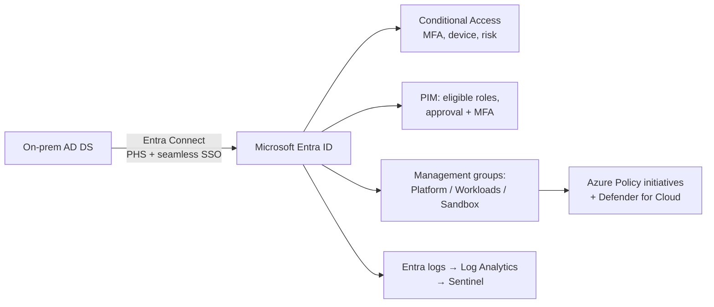
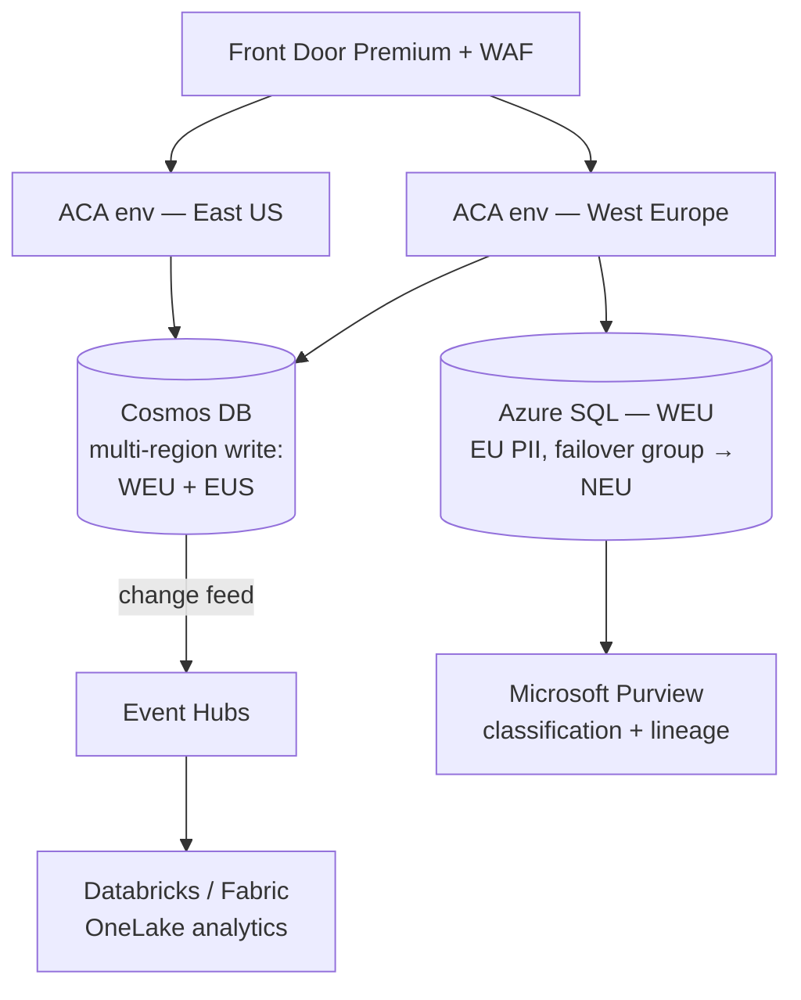
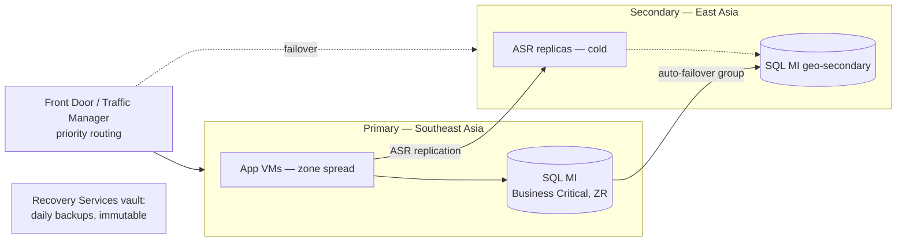
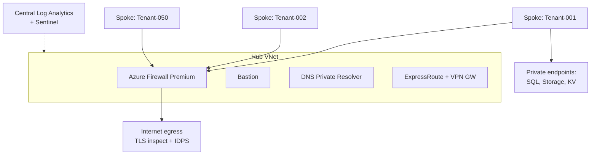
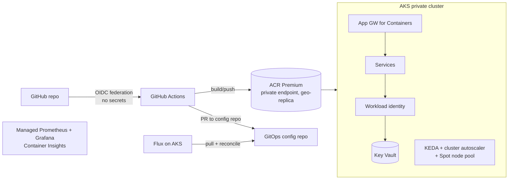

---

## 14. Architecture Walkthroughs (End-to-End Scenarios)

Five named enterprise scenarios in AZ-305 case-study style. For each: requirements → design → justification → failure modes → cost levers.

### 14.1 FinSecure — Hybrid Identity & Governance (financial services)

**Narrative:** FinSecure, a 10,000-employee bank, migrates from on-prem AD to Entra ID. Regulators require MFA for all admins, JIT privileged access, full audit trails, and no standing Owner rights. Budget favors minimal new infrastructure.

**Key decisions & why:**

- **Password hash sync (PHS)** over ADFS/PTA: least infrastructure, cloud-resilient sign-in (works even if on-prem is down), leaked-credential detection. ADFS only if regulators mandated on-prem-only auth — they didn't. *Anti-pattern: deploying ADFS farms "because we always federated" — high ops cost, single point of failure.*
- **Conditional Access baseline:** require MFA for all users (phased), block legacy auth, require compliant devices for admins, sign-in-risk policies via Identity Protection (P2).
- **PIM** for Entra + Azure roles: eligible (not permanent) assignments, approval for Owner/UAA, max 8-hour activations, quarterly access reviews. Satisfies "no standing privilege."
- **Management group hierarchy** with policy initiatives (allowed regions, required tags, deny public IPs in workload MGs) — governance inherited, not per-subscription.
- **Break-glass:** two cloud-only emergency accounts excluded from CA, monitored by alert rules.

**Failure modes:** Entra outage → PHS users still authenticate against cached tokens for existing sessions; on-prem outage → cloud auth unaffected (PHS advantage). Credential compromise → risk-based CA blocks + Identity Protection remediation; audit via Sentinel UEBA.

**Cost:** Entra ID P2 only for admins/high-risk users if licensing is tight; Sentinel data-cap + Basic Logs for verbose tables; no VM infrastructure at all.

### 14.2 ShopSphere — Global Data Platform (e-commerce, GDPR)

**Narrative:** ShopSphere serves EU + US customers, needs <50 ms product reads globally, EU personal data residency (GDPR), order history analytics, and Black-Friday elasticity.

**Key decisions & why:**

- **Cosmos DB (session consistency, autoscale RU)** for catalog/cart: global multi-region writes, partition key `/categoryId` rejected for hot partitions → `/productId` synthetic key chosen. *Trap: Strong consistency globally would gut latency — session suffices for cart UX.*
- **EU PII stays in Azure SQL West Europe** (failover group to North Europe — still EU): satisfies residency; US region gets only pseudonymized order references. Purview classifies and tracks PII lineage.
- **Change feed → Event Hubs → lakehouse:** analytics decoupled from OLTP; no ETL hammering production stores.
- **Blob lifecycle:** product images Hot → Cool 30d → delete stale SKUs; invoices → immutable (WORM) container for 10-year retention.

**Failure modes:** Region loss → Front Door health probes fail over compute; Cosmos multi-write continues (RPO≈0); SQL failover group promotes NEU (RPO seconds, EU-compliant). Data corruption → Cosmos continuous backup PITR; SQL PITR 35d + LTR. DDoS → Front Door + DDoS Network Protection.

**Cost:** Cosmos autoscale absorbs Black Friday (10× scale) without standing capacity; reserved capacity for baseline RUs; ACA scale-to-zero for batch workers; Front Door caching cuts origin egress.

### 14.3 ForgeWorks — Mission-Critical HA/DR (manufacturing, RTO <15 min, RPO <1 h)

**Narrative:** ForgeWorks runs an MES (VM-based, SQL Server) that stops factory lines when down. Targets: RTO 15 min, RPO 1 h, two regions, constrained budget — active-passive acceptable.

**Key decisions & why:**

- **Zones first, regions second:** zone redundancy (99.99%) handles most incidents cheaply; regional DR reserved for true disasters.
- **ASR for app VMs** (RPO seconds–minutes, recovery plans boot app tier in order, scripts re-point connection strings) vs. redeploy-from-backup (hours — fails RTO). Secondary compute is *not running* → near-zero standby compute cost.
- **SQL MI auto-failover group:** listener endpoints mean zero connection-string changes at failover — critical for 15-min RTO. *Anti-pattern: geo-restore-based DR — RTO hours and manual.*
- **Backup ≠ DR:** immutable vault backups defend against ransomware/corruption, which replication would faithfully copy.
- **Quarterly test failovers** in isolated VNets, documented runbook, alert-driven (not manual) failover decision tree.

**Failure modes:** Zone loss → transparent (ZR). Region loss → recovery plan: fail over SQL group, ASR boots VMs, Traffic Manager priority flips; measured RTO ~12 min. Ransomware → immutable backups + MUA; restore clean point-in-time.

**Cost:** ASR charges per protected VM but no running compute; secondary SQL MI is the main standby cost (justified vs. line-stoppage cost); reservations on primary compute; Hybrid Benefit for Windows/SQL licenses.

### 14.4 CloudNest — Secure Multi-Tenant Hub-Spoke (SaaS, 50 customer environments)

**Narrative:** CloudNest hosts 50 isolated customer environments. Requirements: no tenant-to-tenant traffic, centralized egress inspection/logging, private-only PaaS, per-tenant cost attribution.

**Key decisions & why:**

- **Deployment stamps via Bicep module:** each tenant = one spoke VNet + RG + SQL DB (elastic pool) + Key Vault + storage, stamped identically; tags (`tenantId`) drive cost attribution. At 50+ spokes, evaluate **Virtual WAN** for routing scale.
- **Isolation layers:** peering is hub-spoke only (no spoke-spoke); firewall denies inter-spoke by default; NSGs + ASGs within spokes; deny-public-network Azure Policy on all PaaS; private endpoints + central private DNS zones (linked once, resolved via DNS Private Resolver for on-prem admins).
- **Egress:** UDR 0.0.0.0/0 → firewall in every spoke (policy-deployed, deny out-of-band edits with deployment stacks); FQDN allow-lists per tenant tier.
- **Central Log Analytics** with resource-context RBAC → tenants' operators see only their spoke's logs; Sentinel analytics across the estate.

**Failure modes:** Firewall failure → zone-redundant firewall (99.99%); noisy-neighbor → elastic pool per tier + bulkhead stamps; credential compromise in one tenant → blast radius = one spoke (identity- and network-segmented). DDoS → public entry only via Front Door/App GW with WAF; spokes have zero public IPs.

**Cost:** Shared hub (firewall/Bastion/gateways amortized across 50 tenants); elastic pools vs. 50 provisioned DBs; Basic Logs for chatty flow logs; firewall as shared cost allocated by tag-based chargeback.

### 14.5 RetailRocket — AKS at Scale with GitOps (retail)

**Narrative:** RetailRocket replatforms 40 microservices to AKS: needs zero-secret deployments, image governance, progressive delivery, and burst scaling for flash sales.

**Key decisions & why:**

- **AKS over ACA:** the team needs custom operators, Istio add-on, and node-level tuning (ACA would hide these). Private cluster + authorized IP ranges for the API server.
- **GitOps (Flux):** cluster state pulled from Git — auditable, reproducible, no kubectl from pipelines. CI builds images; CD = Git merge. *Anti-pattern: pipelines holding cluster-admin kubeconfigs.*
- **Zero secrets:** GitHub OIDC federation → Entra; workload identity for pods → Key Vault/SQL; ACR pulls via kubelet managed identity + AcrPull; image signing/scanning gates via Defender for Containers + policy (only signed images from trusted ACR).
- **Scaling:** KEDA on queue depth + HPA; **Spot node pool** for stateless burst with taints/tolerations; cluster autoscaler caps; PodDisruptionBudgets protect availability during scale-in.
- **Progressive delivery:** canary via ingress traffic weights, automatic rollback on burn-rate alerts (Prometheus SLOs).

**Failure modes:** Node/zone loss → zone-spread node pools + PDBs; bad release → canary + instant Git revert (GitOps rollback); registry outage → ACR geo-replication; Spot eviction → workloads drain to on-demand pool.

**Cost:** Spot for burst (~90% off), reservations for baseline node pools, ACR geo-replication only to active regions, right-sized requests/limits via Vertical Pod Autoscaler recommendations, Grafana/Prometheus managed (no self-hosted stack).
